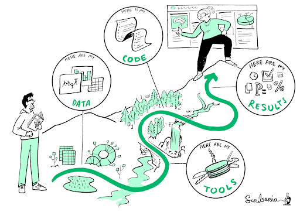

```{r setup, include=FALSE}
knitr::opts_chunk$set(echo = FALSE,
                      out.width = "100%",
                      out.extra="style='border:1px solid black;'")
```


This blog was originally hosted on the [RSSE Africa webpage](https://rsse.africa/post/2024/12/open-science-episode2/)

The **‘Enabling Open Science Through Research Code’** meet-up series, co-hosted by **RSSE Africa** and **RSE Asia**, continues to build momentum. Episode 2, titled **"Enabling Reproducibility Through Research Code,"** took place on November 14, 2024, bringing together a diverse group of participants and experts to discuss a cornerstone of open science—reproducibility. A valuable open educational resource related to this topic, which the meetup was based on, is available from [CodeRefinery](https://coderefinery.github.io/reproducible-research/). 



*The Turing Way Community. This illustration is created by Scriberia with The Turing Way community, used under a CC-BY 4.0 licence. DOI: [10.5281/zenodo.3332807](https://doi.org/10.5281/zenodo.3332807)*  

### **Connecting Researchers Who Code**

A key goal of this series is to connect researchers who code, especially those in Asia and Africa, with peers worldwide to foster collaboration and support. As **Anelda van der Walt (**RSSE Africa) explained:

“There are so many researchers who code, but they’re often isolated and don’t have communities to share tools, best practices, or even just to vent about the challenges. We hope this series can be the starting point for those conversations.”

We welcomed participants from various disciplines, including health-related fields, law, linguistics, and bioinformatics. The audience represented a mix of coding-heavy researchers (spending over 50% of their day coding), less frequent coders, and those just beginning their coding journey.

### **Meet the Panel**

Episode 2 featured a diverse panel of experts who brought their unique perspectives on enabling reproducibility:

* **Kozo Nishida**: Project Researcher, Tokyo University of Agriculture and Technology, Japan  
* **Peter van Heusden**: Bioinformatician, South African National Bioinformatics Institute/University of the Western Cape, South Africa  
* **Radovan Bast**: Research Software Engineer, UiT The Arctic University of Norway, and managing the CodeRefinery project.

### **Panel Discussion: Tips for Enabling Reproducibility**

Reproducibility, in its simplest terms, is about ensuring that research findings can be replicated and validated. Without reproducibility, there’s no way to confirm the reliability of scientific results.

**Saranjeet Kaur Bhogal**, one of the session facilitators from RSE Asia, captured this sentiment perfectly when she said:

"Be your own best collaborator."

This idea resonated with all the panellists, who emphasised the importance of documenting workflows and code in a way that’s accessible and understandable—not just for others, but for your future self.

**Radovan Bast** added to this perspective, explaining:

"The person you will collaborate with most within your academic career is your past and future self. We should be kind to our future selves\!"

Whether six months or years down the line, thorough documentation and explanation of your work ensures you—or anyone else—can reproduce the results.

**Kozo Nishida** shared a practical example from metabolomics research, underlining the challenges of reproducibility in quantifying mass spectrometry data. He explained that creating annotations for mass spec peaks often requires manual tweaks and detailed adjustments. Without thorough documentation and clear steps, reproducing metabolomics quantifications becomes nearly impossible.

**Peter van Heusden** reflected on his experiences entering the field of pathogen bioinformatics. He noted that many research papers described methodologies but often omitted critical details, highlighting the importance of reproducibility. He emphasised:

“If it’s not in code, it’s not really reproducible.”  
For Peter, reproducibility means translating what has been done manually into code, ensuring that workflows are transparent and repeatable.

**Radovan Bast** pointed out that reproducibility encompasses many elements—data, scripts, dependencies, environments, workflows, and more. He acknowledged that achieving perfect reproducibility can be daunting and advised:

“Don’t let perfect be the enemy of good enough.”  
Radovan reminded the audience that reproducibility doesn’t need to be flawless to be valuable. He emphasised the importance of sharing work in a reusable way to avoid reinventing the wheel or wasting time.

### **Practical Tips for Ensuring Reproducibility**

The session provided many actionable tips to help researchers make their work more reproducible. These included advice on file types, documentation tools, and simple practices like running code on a different computer to ensure it works across environments.

As with all sessions in the series, a comprehensive resource sheet summarising these tips is available [here](https://doi.org/10.5281/zenodo.14195613). 

### **The Importance of Community in Reproducibility**

The panel stressed how reproducibility benefits not just individual researchers but entire research communities:

**Radovan Bast** stressed that limited time and resources make it essential to "stand on the shoulders of others" by building on existing tools and workflows rather than starting from scratch every time. However, he cautioned that when using others’ code, researchers should always check the license to ensure they have permission to use it and later share their changes.

**Peter van Heusden** highlighted the importance of structured approaches. Starting projects with standardised templates not only ensures consistency but also makes it easier to reproduce and reuse workflows.

**Kozo Nishida** added that reproducible code enables others to build upon your work, improving entire fields of research. He emphasised the importance of joining communities to share tools, collaborate, and foster reproducibility collectively.

### **Licensing and Assisted Coding**

When using code found online, it’s crucial to respect the provided license and credit the author.

Assisted coding with AI, however, raises unresolved questions about licensing and authorship. The panel noted that clearer guidelines from legal experts are needed as this area continues to evolve. It will be interesting to see how these tools and spaces adapt to address these challenges.

### **Looking Ahead**

The next episode in the series, **"Opening Up Your Code,"** will take place on **December 12, 2024, at 08:30 UTC.** Be sure to register [here](https://rsse.africa/events-rsse-africa/2024-12-12/) and join the conversation\!

For those who missed Episode 2, a [resources sheet](https://zenodo.org/records/14195614) with tips and the [session recording](https://youtu.be/y0z324Jwn4Y) is available. This series is an excellent opportunity to learn, connect, and grow as we work together to enable open science \- one line of code at a time.

*This meetup series is a collaboration between Talarify, RSSE Africa, RSE Asia, AREN, and ReSA.* 

------------------------------------------------------------------------

### **Learn More About Us**

For more information and to join upcoming events, visit:

#### RSSE Africa

-   Website: <https://rsse.africa>\
-   Sign up for our newsletter: <https://talarify.us14.list-manage.com/subscribe?u=35d5db26d3b108b9ef9b9ac43&id=55e9f5a692>\
-   Join our LinkedIn group, where you can also share information with the broader community: <https://www.linkedin.com/groups/12903402/>

#### RSE Asia

-   Website: <https://rse-asia.github.io/RSE_Asia/>\
-   For the latest news, events, activities, and opportunities, follow us on our [LinkedIn page](https://www.linkedin.com/company/rse-asia-association/) (<https://www.linkedin.com/company/rse-asia-association/>)\
-   To join the RSE Asia community, please fill out our short [Community Membership Form](https://docs.google.com/forms/d/1XSxDaTJzcNyGeDYXyJNVg1TDCo7un18PLFNiK6_jL2g/edit) ([https://docs.google.com/forms/d/1XSxDaTJzcNyGeDYXyJNVg1TDCo7un18PLFNiK6\\\_jL2g/edit](https://docs.google.com/forms/d/1XSxDaTJzcNyGeDYXyJNVg1TDCo7un18PLFNiK6_jL2g/edit){.uri})

#### AREN

-   Website: <https://africanrn.org/>\
-   Sign up: <https://docs.google.com/forms/d/e/1FAIpQLSeeFkD5A4D9l6ncQWjKBiI-GqBOzL-JMe7Fx3ijUYEjHjDUoQ/viewform>

#### ReSA

-   Website: <https://www.researchsoft.org/>\
-   Sign up for the newsletter: <https://www.researchsoft.org/news/>\
-   The [Amsterdam Declaration on Funding Research Software Sustainability](https://ogyaqy.clicks.mlsend.com/ty/c/eyJ2Ijoie1wiYVwiOjc3ODEyOSxcImxcIjoxMzM1MDk5NDcxNDA4Njc3OTMsXCJyXCI6MTMzNTA5OTQ4NTg4OTUwNzkzfSIsInMiOiJiMTU2Y2FhYzI3YjQyZjI1In0)
    -   Become a signatory: <https://adore.software/sign/>
