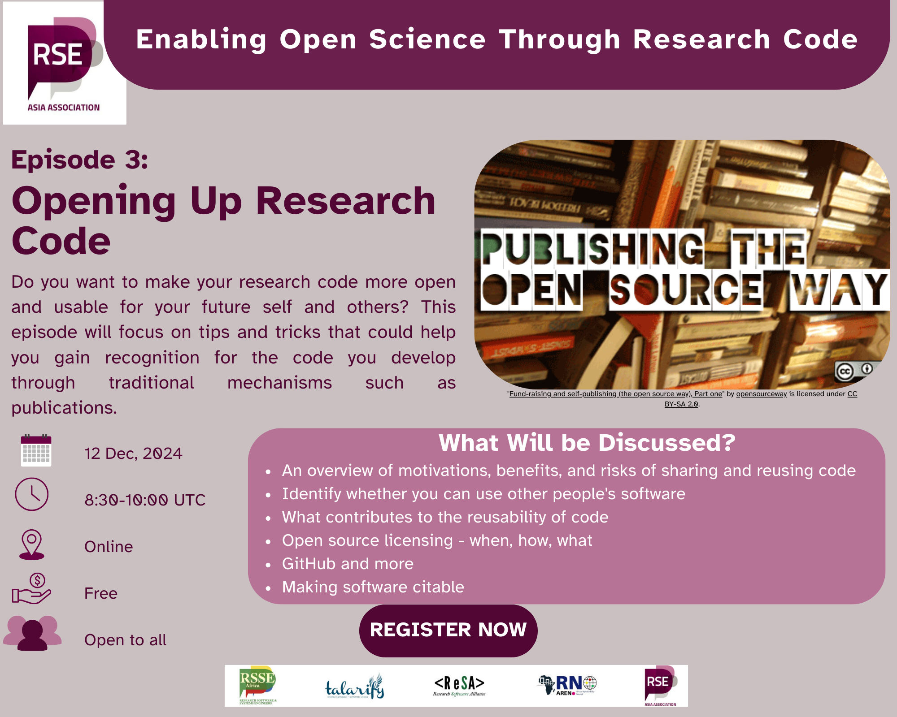

```{r setup, include=FALSE}
knitr::opts_chunk$set(echo = FALSE,
                      out.width = "100%",
                      out.extra="style='border:1px solid black;'")
```



In December 2024, we hosted episode four of our six-part series on Enabling Opening Science through Research Code. This time, we focused on openly sharing research code. The conversation provided invaluable insights into best practices, challenges, and the impact of open source in research. Whether you are a researcher, software developer, or just getting started, here are the key takeaways from this inspiring discussion.

### **Why Open Research Code Matters**

Research software plays a crucial role in scientific discovery. Making it openly accessible enhances transparency, reproducibility, and collaboration. The discussion highlighted several reasons why open code can be beneficial to those who develop it as well as the broader research community:

* **Reproducibility & Credibility**: When researchers share their code, others can validate and build upon it, ensuring scientific integrity.  
* **Collaboration & Community Growth**: Open software enables researchers and developers worldwide to work together, improving tools and methodologies.  
* **Increased Citations & Impact**: Studies with accessible code tend to receive more citations, increasing the visibility and influence of the research.  
* **Funding & Institutional Support**: Many funding agencies now require researchers to share code and data as part of open science initiatives.

### **Challenges and How to Overcome Them**

While making code open has clear benefits, it comes with its own set of challenges. Speakers shared personal experiences and solutions to common obstacles:

* **Fear of Criticism**: Many researchers worry that sharing their code may invite scrutiny. However, constructive feedback leads to improved code quality.  
* **Maintaining Code Over Time**: Researchers often move on to new projects and cannot maintain old code. One solution is to create a community around a project, inviting contributors to help maintain and improve it.  
* **Data Privacy & Intellectual Property**: Researchers must anonymise datasets or create synthetic versions that simulate actual data while maintaining confidentiality when dealing with sensitive data.  
* **Documentation & Reusability**: A well-documented project is far more valuable to others. Providing README files, usage instructions, and licensing information makes it easier for others to use and contribute.   
  * We talk more about documentation in [Episode 4](https://zenodo.org/records/14833914)\!

### **Best Practices for Sharing Research Code**

To make code truly open and useful, researchers can consider the following best practices:

1. **Use Version Control Platforms**: Platforms like GitHub, GitLab, and Bitbucket facilitate collaboration, version tracking, and code sharing.  
2. **Choose an Appropriate License**: Open source licenses like MIT, Apache 2.0, and GPL define how others can use and modify the code.  
3. **Provide Clear Documentation**: A README file explaining installation, usage, dependencies, and citation details makes the code accessible to others.  
4. **Include Citation Information**: Using a `CITATION.cff` file ensures that researchers get credit for their work when their code is used in publications.  
5. **Use Containerisation for Reproducibility**: Tools like Docker and GitHub Code Spaces help ensure that code runs the same way on different machines.  
6. **Leverage Community Support**: Engaging with communities like Research Software Engineering (RSE) groups, The Carpentries, and others provides learning opportunities and networking.

### **Diverse Perspectives on Open Science**

The discussion brought together speakers from various backgrounds, including bioinformatics, linguistics, software engineering, and illustration. Their stories emphasised that open science is not just for software developers but also for researchers and creatives working in different fields.

* [**Adeyinka Oresanya**](https://linkedin.com/in/adeyinkaoresanya)**,** a **software developer** **at CHAOSS** in Nigeria  
* [**Chioma Onyido**](https://www.linkedin.com/in/chioma-onyido/), a **bioinformatician** from Nigeria, shared how **Bioconductor**, an open-source project for bioinformatics, has been instrumental in her work.  
* [**Mars Lee**](https://www.linkedin.com/in/mars-lee/), a **technical illustrator**, highlighted the importance of visual documentation to make open source more accessible.  
* [**Kate Huddlestone**](https://www.researchgate.net/profile/Kate-Huddlestone)**, a linguist** at Stellenbosch University in South Africa, shared how open-source tools enabled her to work with sign language data, significantly advancing her research.  
* [**Juan Pablo**](https://orcid.org/0009-0003-0208-8480)**, a senior program manager at GitHub**, discussed how GitHub provides tools like citation files and ORCID integration to make research software more discoverable and citable.

### **Final Advice for Researchers Interested in Open Code**

Each speaker shared a key piece of advice for those looking to engage in open research software:

* **Join a Community**: Engaging with open-source and research communities provides learning and collaboration opportunities.  
* **Take Small Steps**: Even minimal documentation, a simple README, or choosing a license makes a big difference.  
* **Leverage Available Resources**: Many educational institutions provide free access to GitHub tools and training programs.  
* **Don’t Fear Making Mistakes**: Sharing imperfect code is better than keeping it inaccessible. The community will help improve it.

### **Conclusion**

Opening research code benefits both individual researchers and the broader scientific community. By embracing best practices and leveraging community support, researchers can enhance collaboration, improve research reproducibility, and increase the impact of their work. Whether you are just starting or looking to improve your open science practices, remember that engagement, documentation, and a willingness to share and learn are the keys to success.

*The first draft of this blog post was created with ChatGPT from the edited video transcript.*

### **Looking Ahead**

The next episode in the series, **"Documentation for Research Code"** will take place on **January 23, 2025, at 08:30 UTC.** Be sure to register [here](https://us06web.zoom.us/meeting/register/tZ0scOmspz0iH9IMt4yxc0O37uEUUiPxYDxa#/registration) and join the conversation\!

For those who missed Episode 3, a [resources sheet](https://zenodo.org/records/14833789) with tips and the [session recording](https://www.youtube.com/watch?v=cDq9UMSOkhs) is available. This series is an excellent opportunity to learn, connect, and grow as we work together to enable open science \- one line of code at a time.

*This meetup series is a collaboration between Talarify, RSSE Africa, RSE Asia, AREN, and ReSA.* 

------------------------------------------------------------------------

### **Learn More About Us**

For more information and to join upcoming events, visit:

#### RSSE Africa

-   Website: <https://rsse.africa>\
-   Sign up for our newsletter: <https://talarify.us14.list-manage.com/subscribe?u=35d5db26d3b108b9ef9b9ac43&id=55e9f5a692>\
-   Join our LinkedIn group, where you can also share information with the broader community: <https://www.linkedin.com/groups/12903402/>

#### RSE Asia

-   Website: <https://rse-asia.github.io/RSE_Asia/>\
-   For the latest news, events, activities, and opportunities, follow us on our [LinkedIn page](https://www.linkedin.com/company/rse-asia-association/) (<https://www.linkedin.com/company/rse-asia-association/>)\
-   To join the RSE Asia community, please fill out our short [Community Membership Form](https://docs.google.com/forms/d/1XSxDaTJzcNyGeDYXyJNVg1TDCo7un18PLFNiK6_jL2g/edit) ([https://docs.google.com/forms/d/1XSxDaTJzcNyGeDYXyJNVg1TDCo7un18PLFNiK6\\\_jL2g/edit](https://docs.google.com/forms/d/1XSxDaTJzcNyGeDYXyJNVg1TDCo7un18PLFNiK6_jL2g/edit){.uri})

#### AREN

-   Website: <https://africanrn.org/>\
-   Sign up: <https://docs.google.com/forms/d/e/1FAIpQLSeeFkD5A4D9l6ncQWjKBiI-GqBOzL-JMe7Fx3ijUYEjHjDUoQ/viewform>

#### ReSA

-   Website: <https://www.researchsoft.org/>\
-   Sign up for the newsletter: <https://www.researchsoft.org/news/>\
-   The [Amsterdam Declaration on Funding Research Software Sustainability](https://ogyaqy.clicks.mlsend.com/ty/c/eyJ2Ijoie1wiYVwiOjc3ODEyOSxcImxcIjoxMzM1MDk5NDcxNDA4Njc3OTMsXCJyXCI6MTMzNTA5OTQ4NTg4OTUwNzkzfSIsInMiOiJiMTU2Y2FhYzI3YjQyZjI1In0)
    -   Become a signatory: <https://adore.software/sign/>
