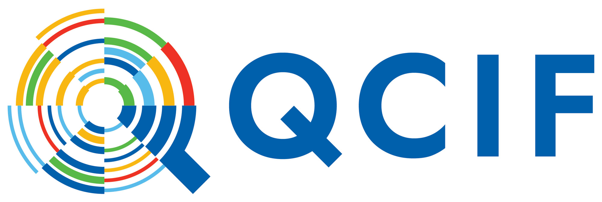

```{r setup, include=FALSE}
knitr::opts_chunk$set(echo = FALSE,
                      out.width = "100%",
                      out.extra="style='border:1px solid black;'")
```


_Banner of RSE Asia Australia conference 2022 - building the research software community across Asia and Australia._

We invite you to join us for the first online Research Software Engineer (RSE) Asia Australia Unconference from the *14th to the 16th of September 2022*. This is a joint partnership between the newly formed [RSE Asia Association](https://rse-asia.github.io/RSE_Asia/) and the [RSE Association of Australia and New Zealand](https://rse-aunz.github.io/). 

We would like to thank our Key partners [ARDC](https://ardc.edu.au/) and [QCIF](https://qcif.edu.au/) for supporting us, as well as our Accessibility partner, the [Society for Research Software Engineering](https://society-rse.org/), and our Allied partners, [NCI Australia](https://nci.org.au/) and [Google Cloud for researchers](https://cloud.google.com/edu/researchers).

A copy of our report is available at "Mosbergen, Rowland (2022): Research Software Engineer Asia Australia Unconference Summary Report. figshare. Online resource. https://doi.org/10.6084/m9.figshare.21201989". This [includes an accessible report in Microsoft Word format](https://figshare.com/articles/online_resource/Research_Software_Engineer_Asia_Australia_Unconference_Summary_Report/21201989?file=38069379).

Check the video playlist with our keynotes and panel discussion [https://tinyurl.com/RSEAA2022-videos](https://tinyurl.com/RSEAA2022-videos).

<iframe width="560" height="315" src="https://www.youtube.com/embed/videoseries?si=6u_gUtJtmmWKj9v0&amp;list=PLG25fMbdLRa7qN6nY8kcBZlccmMI7wP_1" title="YouTube video player" frameborder="0" allow="accelerometer; autoplay; clipboard-write; encrypted-media; gyroscope; picture-in-picture; web-share" referrerpolicy="strict-origin-when-cross-origin" allowfullscreen></iframe>

### What is a Research Software Engineer? 

Research Software Engineer is a broad term for people who combine programming and research skills that have trouble defining their role and value within academia. e.g researchers and academics who code, generalists who bring communities together across the research and technical domains, systems administrators who maintain research systems, and software engineers who work in the research domain. 

### Why participate?

This will be run as a participant-first online unconference to ensure you have a say on how we develop the community and to allow you to share your valuable technical and social knowledge of research software with the community. In line with that, the theme for this year's unconference is “Building community”.

Together, we can create a sustainable community that benefits research software engineers by raising recognition and building career paths for RSEs, and ultimately contributes to more efficient and reproducible research.

We also hope that this experience will identify ways to positively engage with senior leaders who are working on policies that directly affect you and the rest of the RSE community. 

<a class="rse rse-join" href="https://www.eventbrite.com.au/e/rse-asia-australia-unconference-2022-tickets-372580998797">Register here</a> (_This registration is closed now._)

### What is an unconference?

The unconference will run online over three half-days from [13:00 to 17:00 AEST](https://www.timeanddate.com/worldclock/fixedtime.html?iso=20220914T03&p1=1440&ah=4) on 14, 15 and 16 of September. An unconference is where the agenda is created by the attendees at the beginning of the meeting. Anyone who wants to initiate a discussion on a topic can claim a time and a space [1]. 

For this particular unconference, we will create breakout groups for the top three topics for each session. At the start of each day we will have an introduction session to provide the participants with some ideas on what they might want to discuss during the conference. We aim to summarise topics and make these available publicly after the unconference.

An overview of what the program will look like is below.

1. https://en.wikipedia.org/wiki/Unconference

### Draft Programme

All times in UTC+10


|             | **Day 1 - 14th September**                 | **Day 2 - 15th September** | **Day 3 - 16th September** |
|-------------------|-------------------------------|------------------|-------------------|
| **1:00PM - 1:30PM** | Welcome, Vision, Explanation, and Partners | Explain, Review            | Explain, Review            |
| **1:30PM - 2:00PM** | Early Career RSE keynote                   | Mid Career RSE keynote     | Strategy & Policy Panel    |
| **2:00PM - 2:30PM** | Introductions to connect                   | Second Session             | Strategy & Policy Panel    |
| **2:30PM - 3:00PM** | Introductions to connect                   | Second Session             | Strategy & Policy Panel    |
| **3:00PM - 3:30PM** | Break                                      | Break                      | Break                      |
| **3:30PM - 4:00PM** | First Session                              | Third Session              | Actionable items           |
| **4:00PM - 4:30PM** | First Session                              | Third Session              | Actionable items           |
| **4:30PM - 5:00PM** | Early Career RSE keynote                   | Review and discussion      | Close and thank you        |

### Flyers


### Key Dates

- SAVE the dates! *14th to the 16th of September 2022* [13:00 to 17:00 AEST](https://www.timeanddate.com/worldclock/fixedtime.html?iso=20220914T03&p1=1440&ah=4)
- Monday 27th June 2022: Registration opens
- Monday 15th August 2022: Deadline for accessibility grants
- Wednesday 31st August 2022: Deadline for applying to scholarship
- Wednesday 7th September 2022: Registration closes
- Tuesday 13th September 2022: Optional Local Hub meetups in person
- Wednesday 14th September 2022: Start of unconference, **Junior RSE Keynote**
- Thursday 15th September 2022: **Senior RSE Keynote**
- Friday 16th September 2022: End of unconference, **RSE Strategy Policy Panel**

*All dates combined to an .ics file for your Calendar App: <A href="/assets/RSEAA2022-v280622.ics">RSEAA2022.ics</a>*

### Registration 

Registration [is now open here](https://www.eventbrite.com.au/e/rse-asia-australia-unconference-2022-tickets-372580998797). 

Registration will close on the 7th of September 2022.

### Accessibility and Inclusivity

We are committed to creating a safe, accessible, and inclusive environment for all participants.

To this end we are offering 50 scholarships for staff or students to participate for free, as well as a $50 AUD accessibility micro-grant to help with internet, headphones, childcare etc.

Eligibility for the scholarships will be based on prioritising and maximising the inclusion and participation of people who have been impacted due to the cumulative effects of discrimination on factors such as race, gender, disability, gender identity, financial status,and the intersectionality of that discrimination as well as others not mentioned here.

Eligibility for the accessibility micro-grants will be based on a similar approach.

[Liz Hare](https://twitter.com/DogGeneticsLLC) has provided a [high-level accessibility report for the conference](RSEAUNZAccessibility.html). 

### How to apply for the scholarship and accessibility micro-grant

To apply for the scholarship, please email us at _rse2022 at rse-aunz dot org_ with the subject [Scholarship] and why you would like to attend for free and how this would benefit you and your organisation (200 words maximum).

To apply for the accessibility micro-grant, please email us at _rse2022 at rse-aunz dot org_ with the subject [Accessibility]  and why you would like a micro-grant, how would you use it and how attending would benefit you (200 words maximum).

If you are applying for both, please email us separately.

We encourage participants to apply even if they do not think they are eligible as this will allow us to prioritise and maximise diversity and inclusion. All information will be treated in a confidential manner.

If you feel that the unconference is not matching up to the commitment of these ideals, please let us know by contacting the organising committee at _rse2022 at rse-aunz dot org_.

The [Code of Conduct](https://rse-aunz.github.io/code-of-conduct) is designed to provide all participants with community participation guidelines.

### Partner with us

If your organisation would like to partner with us, there are still Allied partnerships available. To see how that would benefit your organisation, please see the [Unconference Partner Prospectus](RSEAA018 Unconference Partner Prospectus.pdf).

### Contact Us

If you would like to know more or have any questions, please contact the organising committee at _rse2022 at rse-aunz dot org_ by email.

### Aligned Conferences & Events

September is full of RSE conferences around the world!

- September 6-8, [RSECon2022 is in person](https://rsecon2022.society-rse.org/) at Newcastle University in the UK
- September 12-13, [NZRSE 2022](https://www.rseconference.nz/) online
- September 13, possible in person meetings for RSEs in Australia and New Zealand main cities (see details in the registrations)
- September 14-16, RSE Asia Australia Unconference 2022 Online


### Download Flyer

The flyer [can be downloaded here](RSEAA22_Unconference_Flyer.png).

Here is the suggested text to complement the flyer:

*For those who are interested, we invite you to the first online Research Software Engineer (RSE) Asia Australia Unconference from the 14th to the 16th of September 2022. This is a joint partnership between the newly formed RSE Asia Association and the RSE Association of Australia and New Zealand. We have made the costs low ($10 to $20 AUD) to attract a broader audience, and there are 50 scholarships available, as well as a $50 AUD accessibility micro-grant. Details here: https://rse-aunz.github.io/2022-Asia-Australia-unconference/*


### Key Partners

{width=20%}


{width=20%}


### Accessibility Partner
{width=20%}


### Allied Partner
{width=20%}

{width=20%}