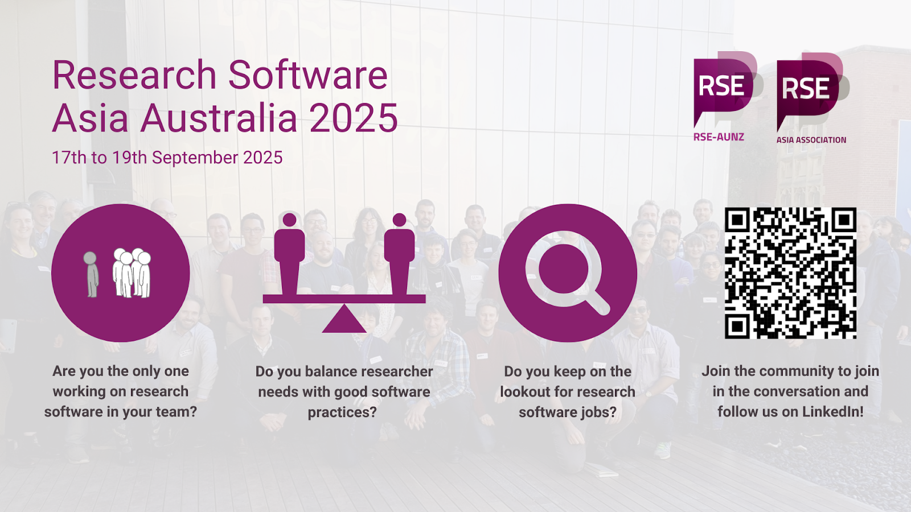

```{r setup, include=FALSE}
knitr::opts_chunk$set(echo = FALSE,
                      out.width = "100%",
                      out.extra="style='border:1px solid black;'")
```



For more information about the conferene, please visit [rseaa.org](https://rseaa.org/) and follow us at [Research Software Asia Australia 2025](https://www.linkedin.com/company/rseaa).
