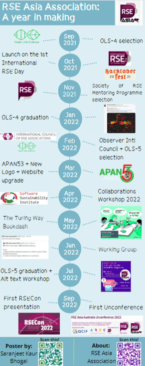

  
  
```{r setup, include=FALSE}
knitr::opts_chunk$set(echo = FALSE,
                      out.width = "100%",
                      out.extra="style='border:1px solid black;'")
```

*Click below for the slide.*
  
<a href="`r rmarkdown::metadata$url`">
```{r}

```
</a>
