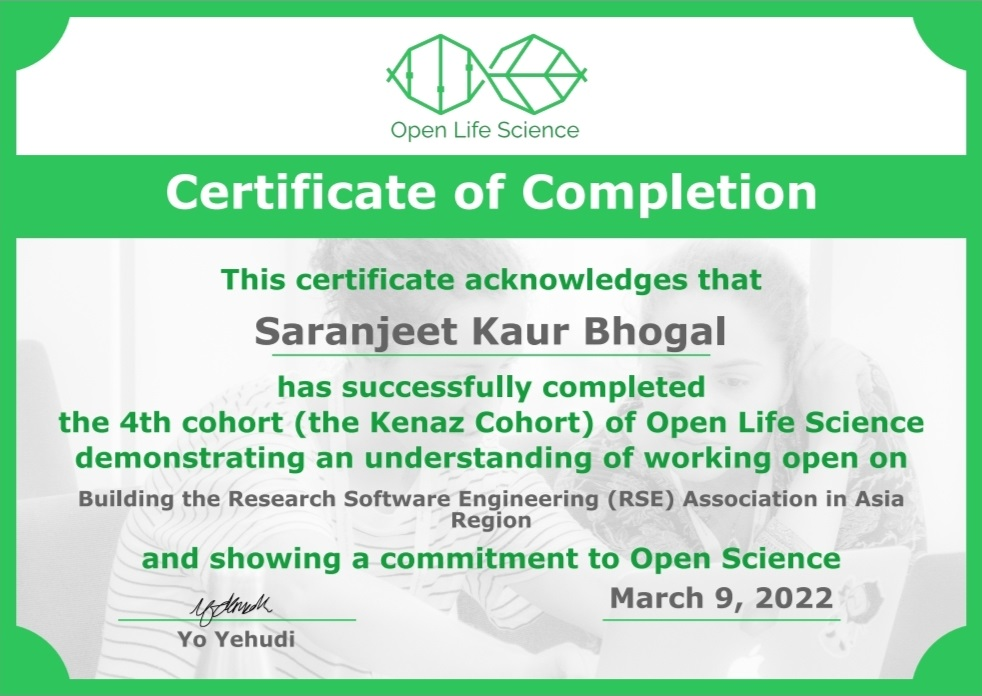
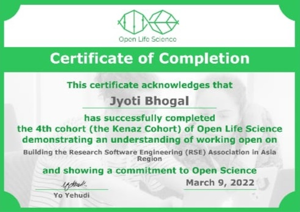

```{r setup, include=FALSE}
knitr::opts_chunk$set(echo = FALSE)
```

```{r metathis, message=FALSE, warning=FALSE, include=FALSE}
library(metathis)
meta() %>%
  meta_description(
    "Brief description about the journey of RSE Asia Association"
  ) %>%
  meta_name("github-repo" = "rse-asia/RSE_Asia") %>%
  meta_viewport() %>%
  meta_social(
    title = "About Us",
    url = "https://rse-asia.github.io/RSE_Asia/aboutus.html",
    image = "https://github.com/rse-asia/RSE_Asia/blob/main/images/Updated_RSE_Asia_logo.jpg",
    image_alt = "The RSE Asia Association logo inspired from the logo of the Society of Research Software Engineering - Labelled RSE on top in white capital letters and labelled ASIA below in capital letters.",
    og_type = "website",
    og_author = c("RSE Asia Association"),
    twitter_card_type = "summary",
    twitter_creator = "@RSE_Asia"
  )
```


```{r eval = FALSE}
knitr::include_graphics("images/ella_profile.jpeg")
```


## History

The RSE Asia Association was launched during a project under the [Open Life Science Cohort-4 programme (OLS-4)](https://openlifesci.org/ols-4/projects-participants/#) programme by [Saranjeet Kaur Bhogal](https://saranjeetkaur.github.io/About-Me/) and [Jyoti Bhogal](https://www.linkedin.com/in/jyoti-bhogal-a20705163/), under the Mentorship of [Anne Fouilloux](https://github.com/annefou). It was launched on Thursday, 14th October 2021, which is also the first [International RSE Day](https://researchsoftware.org/council/intl-rse-day.html). At the launch event we conducted activities for contributing to [Hacktoberfest 2021](https://hacktoberfest.digitalocean.com/). Both Saranjeet and Jyoti graduated from the OLS-4 during early 2022 (graduation certificates below). 

:::float-image

```{r out.width='330px', out.extra='style="float:left; padding:10px"', echo=FALSE}


```

:::

Furthermore, under the [Pilot Mentoring Programme](https://society-rse.org/events/pilot-mentoring-programme/) of the [Society of Research Software Engineering](https://society-rse.org/), Saranjeet is working on the building community around the RSE Asia Association, mentored by [Michelle Barker](https://www.researchsoft.org/people/). Jyoti is working on a project titled "Building Pathways for Onboarding to Research Software Engineering (RSE) Asia Association and Adoption of Code of Conduct" as mentee in the  the [Open Life Science Cohort-5 programme (OLS-5)](https://openlifesci.org/ols-5/projects-participants/#) under the mentorship of [Malvika Sharan](https://malvikasharan.github.io/).

## Founders

- [Saranjeet Kaur Bhogal](https://saranjeetkaur.github.io/About-Me/)
- [Jyoti Bhogal](https://jyoti-bhogal.github.io/about-me/)

## Advisory Board

- [Anne Fouilloux](https://github.com/annefou)
- [Michelle Barker](https://www.researchsoft.org/people)
- [Rowland Mosbergen](https://au.linkedin.com/in/rowlandm-gaicd)
