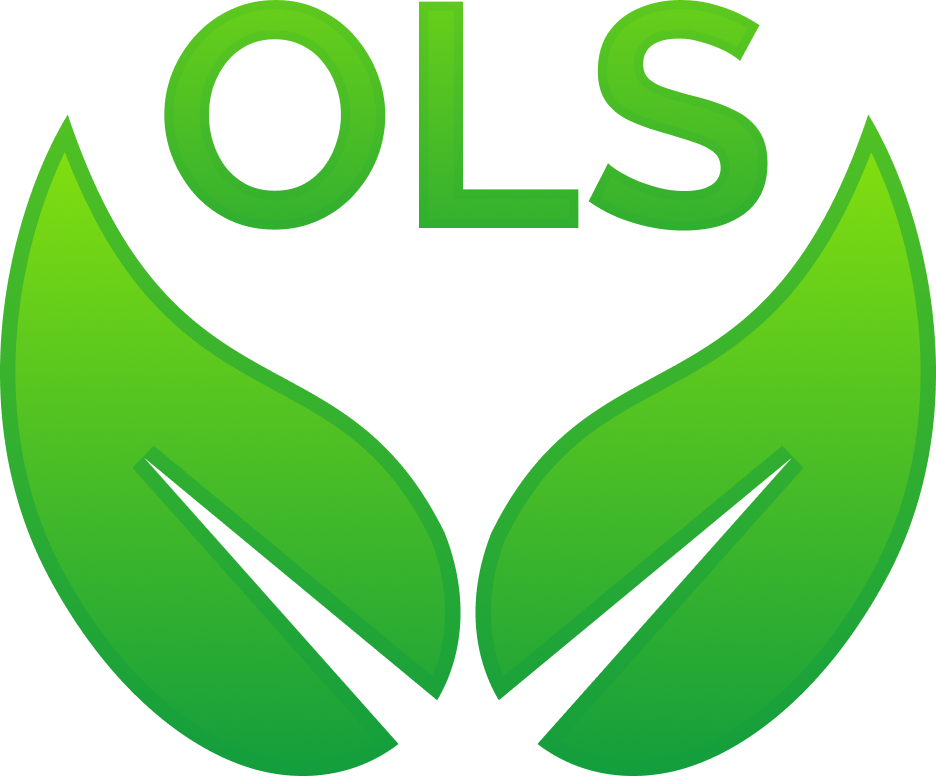
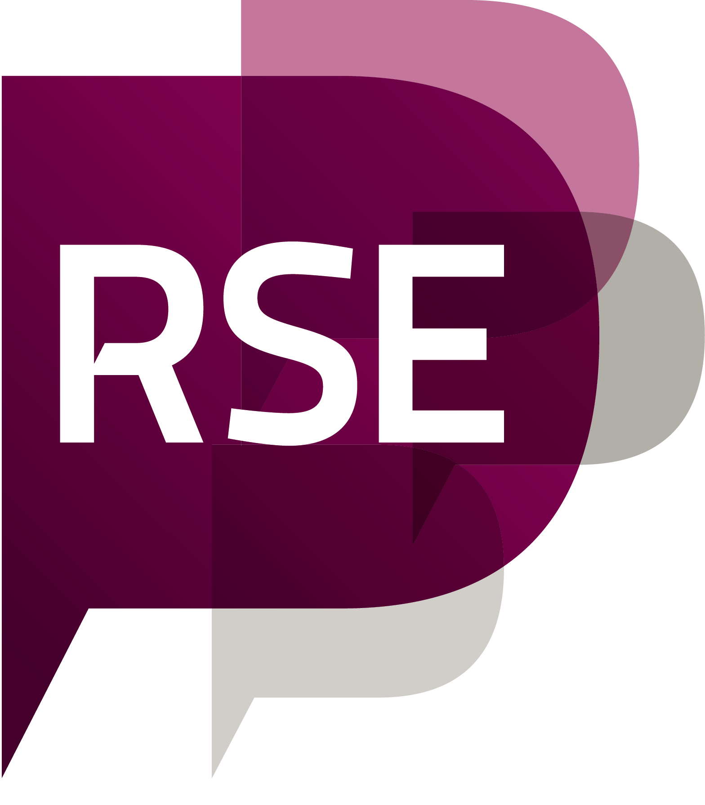

---
# Leave the homepage title empty to use the site title
title: 
date: 2022-10-24
type: landing

sections:
  - block: hero
    content:
      title: |
        RSE Asia Association
      image:
        filename: logo.png
      text: |
           
           The Research Software Engineering Asia Association (RSE Asia) is a volunteer run community with the mission to promote and build the Research Software Engineering community and profession in the Asian region while also fostering global collaborations, since its launch on the first International RSE Day on Thursday, 14th October 2021.
 
           All spaces of the RSE Asia Association are bound by the [code of conduct](https://society-rse.org/about/code-of-conduct/) of the [Society of Research Software Engineering](https://society-rse.org/).

    design:
      background:
        text_color:
      spacing:
        padding: ["3rem", "5rem"]

  - block: markdown
    content:
      title: Our Mentor Organisations
      text: |   

        

        

          

            
          

          

            
          

         

        
            
    design:
      background:
        text_color_light:      
      spacing:
        padding: ["3rem", "5rem"]  

  - block: markdown
    content:
        title: Recent and Upcoming Events
      #  text: |
      #      

       #      <iframe width="550" height="283" src="https://w2.countingdownto.com/7181598" frameborder="0"></iframe>
        #    

       #    <a class="rse rse-join" href="./event" title="Events"><strong>See more →</strong></a>
    design:
      background:
        text_color_light:      
      spacing:
        padding: ["3rem", "5rem"] 
    
  - block: collection
    content:
      title: Latest News
      subtitle:
      text:
      count: 3
      filters:
        author: ''
        category: ''
        exclude_featured: false
        publication_type: ''
        tag: ''
      offset: 0
      order: desc
      page_type: post
    design:
      view: compact
      columns: '1'
  
  # - block: collection
  #   content:
  #     title: Latest Preprints
  #     text: ""
  #     count: 5
  #     filters:
  #       folders:
  #         - publication
  #       publication_type: 'article'
  #   design:
  #     view: citation
  #     columns: '1'

  - block: markdown
    content:
      title:
      subtitle:
      text: |
        <a class="rse rse-join" href="./people"> <strong>Meet the team →<strong></a>
    design:
      columns: '1'

  - block: markdown
    content:
      title: "Connect with us"
      subtitle: ""
      text: |
        

          <a href="https://github.com/rse-asia/RSE_Asia" target="_blank" title="GitHub">
            <i class="fab fa-github fa-2x" style="margin: 0 15px;"></i>
          </a>
          <a href="mailto:rse.asia.association@gmail.com" target="_blank" title="Email">
            <i class="fas fa-envelope fa-2x" style="margin: 0 15px;"></i>
          </a>
          <a href="https://www.linkedin.com/company/rse-asia-association/" target="_blank" title="LinkedIn">
            <i class="fab fa-linkedin fa-2x" style="margin: 0 15px;"></i>
          </a>   
          <a href="https://www.youtube.com/@RSEAsiaAssociation" target="_blank" title="YouTube">
            <i class="fab fa-youtube fa-2x" style="margin: 0 15px;"></i>
          </a>
        

    design:
      background:
        text_color_light:
      spacing:
        padding: ["3rem", "3rem"]  
  
---
