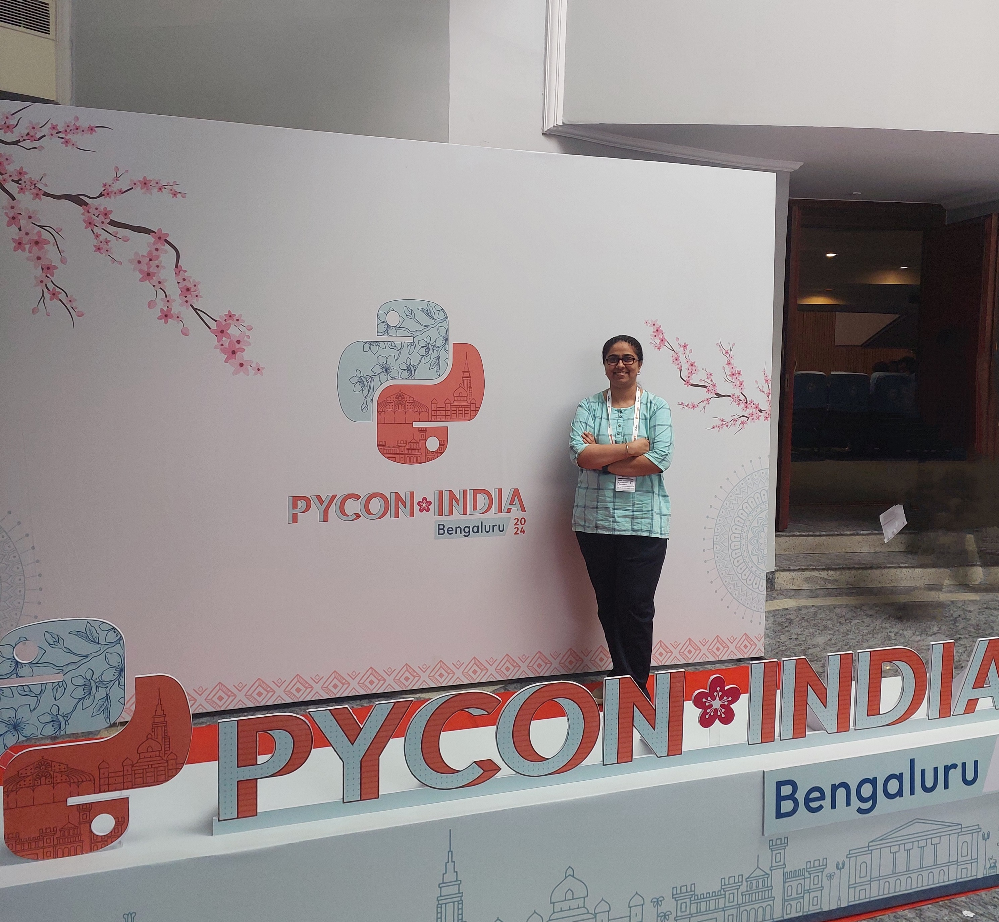
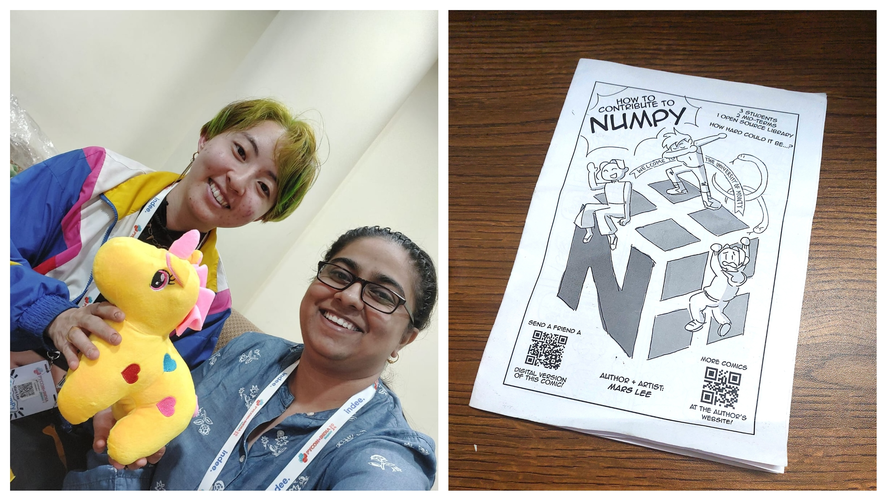

## Overview

The PyCon India 2024 conference, held from September 20-23 at the NIMHANS Convention Center in Bengaluru, brought together a vibrant mix of sessions designed for learning, engagement, and networking. I experienced a diverse lineup, including keynotes, technical talks, hands-on workshops, lightning talks, poster sessions, and open forums (birds of feather (BoF) sessions). Sponsor stalls added to the excitement, and the open spaces allowed for spontaneous interactions, adding to the conference's lively atmosphere. Celebrating its 15th anniversary this year, PyCon India 2024 marked my second time attending, following my first experience at PyCon India 2023 in Hyderabad.

## Lightning Talks

I had the opportunity to present a Lightning Talk titled *"Accelerating India's Open Science Journey with Python."* In my session, I introduced the audience to the concept of open science, highlighting its importance for India, exploring its four foundational pillars, and demonstrating how Python plays a vital role in advancing open science efforts. The talk was well-received, and you can view the slides on [Zenodo](https://zenodo.org/records/13826028).

Click below to view video:

<iframe width="560" height="315" src="https://www.youtube.com/embed/lX896C6QUsE?si=3RwkwLRfNdqWATzb&amp;start=1060" title="YouTube video player" frameborder="0" allow="accelerometer; autoplay; clipboard-write; encrypted-media; gyroscope; picture-in-picture; web-share" referrerpolicy="strict-origin-when-cross-origin" allowfullscreen></iframe>

## Keynotes

The conference featured four insightful keynotes:

1. [Kovid Goyal](https://kovidgoyal.net/) presented *"Making Python Programs Fast,"* where he shared in-depth techniques to optimize Python performance using C language.  
2. [Usha Rengaraju](https://www.linkedin.com/in/usha-rengaraju-b570b7a2/) spoke on *"AI for Autism,"* shedding light on neurodiversity and the potential of AI in autism research.  
3. [Mars Bar Lee](https://www.linkedin.com/in/mars-lee/) explored *"How Open-Source Opened My Opportunities,"* highlighting how contributions to open-source projects can extend beyond code, such as her technical illustrations for NumPy.  
4. [James Powell](https://www.linkedin.com/in/dontusethiscode/) delivered a creative talk, *"How Many Oranges?"*

Each keynote brought valuable perspectives, and Mars Bar Lee’s emphasis on non-code contributions was particularly interesting. I got to meet Mars in-person, after having met online previously for a workshop on importance of alt text with images for improving digital accessibility.

## Workshops

The first day had 3-hour workshops going on in three tracks. I attended two immersive workshops:

1. Chat with Tables: Developing Q\&A system on Tabular data using Code Generative LLMs by [Abhijeet Kumar](https://www.linkedin.com/in/abhijeet-kumar-1aa8b0138/)

   Abhijeet conducted a workshop about Generative AI powered by Large Language Models (LLMs) that are revolutionizing text, image, and video generation, as well as coding through enterprise solutions like GitHub Copilot, Google’s Gemini Code Assist, IBM’s Watsonx, and Amazon’s Q Developer. Abhijeet's workshop focused on leveraging code-generating LLMs to enable non-technical users to generate Python code by using natural language queries, bridging the gap for business users who lack programming skills but need quick data insights. This solution is valuable for business users who often require ad-hoc analysis of tabular data but rely heavily on data teams. Abhijeet demonstrated a workflow to query tabular data, generate insights from CSVs, and enhance natural language querying (NLQ) through techniques like few-shot prompting, pruning, and validation. Additionally, the session included setting up a streamlined process for building Q\&A systems for tabular data and creating a Streamlit app, making data insights more accessible to non-technical analysts.

2. From Zero to Backend Hero: Creating Full-Featured Apps with FastAPI by [Vivek Keshore](https://www.linkedin.com/in/vivek-keshore/?original_referer=https%3A%2F%2Fwww%2Egoogle%2Ecom%2F&originalSubdomain=in)

   Vivek started by interacting with the audience to gather basic information like what an API is, the different types of APIs, and the various types of calls. Vivek discussed the benefits of using FastAPI. He went on to discuss database design. Vivek discussed about implementation of Pydantic models and the development of user management APIs.

## PyLadies Luncheon

The PyLadies Luncheon was a personal highlight during the conference. Women attendees gathered to share their experiences, openly discussing the challenges they face related to diversity and inclusivity in their workplaces and how they’ve overcome these obstacles over time. Hearing these stories and learning about the resilience and strategies of others was truly inspiring and energizing for me.

## Sponsor Stalls

The conference featured several sponsor stalls, and one that stood out to me was the [National Payments Corporation of India (NPCI)](https://www.linkedin.com/company/npci/), an umbrella organization for retail payments and settlement systems in India. I was intrigued to learn how their payments ecosystem is entirely open-source, with data storage managed on-premises instead of on Cloud platforms. Additionally, they introduced me to UPI payments that can be made via phone call or SMS, allowing transactions without an internet connection.

## DevSprints

The DevSprint was a one-day event featuring around 20 different projects. The day began with core contributors providing an overview of their respective projects, allowing participants to choose any project they were interested in contributing to. Among the various projects, I found myself particularly drawn to Django and NumPy.

I opted to join the [NumPy](https://github.com/numpy/numpy) DevSprint, facilitated by technical illustrator Mars Bar Lee and NumPy core contributor [Sebastian Berg](https://github.com/seberg). They introduced all the contributors to the NumPy project, outlining various ways to engage with the community through community calls, mailing lists, and comics, as well as how to contribute effectively. If you're interested in contributing to NumPy, you can refer to the [Contributing Guidelines](https://github.com/numpy/numpy/blob/main/CONTRIBUTING.rst) for more information.

I had the opportunity to attend an open session led by [Saptak S.](https://www.linkedin.com/in/saptaks/), where participants discussed the nuances of digital accessibility, particularly in website development. The discussion covered essential points such as ensuring adequate contrast between text and background colors, structuring headings (H1, H2, H3, etc.) correctly, and guidelines for including appropriate details in the alt text for images. I discovered several valuable online resources to check and test webpage accessibility, including:

* [A11y Project](https://www.a11yproject.com/checklist/): A checklist for assessing accessibility levels.  
* [axe DevTools](https://www.deque.com/axe/devtools/): A tool that evaluates whether a website complies with accessibility guidelines, available as an extension for Chrome, Firefox, and MS Edge browsers.  
* [WAVE](https://wave.webaim.org/): A tool that highlights areas of a website that are well or poorly designed regarding accessibility. WAVE also offers extensions for Chrome, Firefox, and MS Edge browsers.  
* [The Button Cheat Sheet](https://www.buttoncheatsheet.com/): A resource to determine if buttons on a website's UI are designed effectively.  
* [The WebAIM Million](https://webaim.org/projects/million/): The 2024 report on the accessibility of the top 1,000,000 home pages.

We discussed key considerations for developers when creating digitally accessible web pages. For instance, keyboard navigation is crucial for individuals with visual impairments or otherwise while working with a document by using only the keyboard, necessitating a logical heading structure (e.g., H1 followed by H2, and so on). It’s important to avoid jumping from say, H1 to H4, as this can confuse users.

In terms of coding practices, developers should specify the document language by adding the ‘lang’ attribute. This helps indicate which programming language is being used for different sections of the website. Additionally, tools like [JAWS](https://www.freedomscientific.com/products/software/jaws/) provide voice assistance to help developers ensure accessibility standards are met.

During Continuous Integration (CI), it’s essential for developers to incorporate these accessibility guidelines into their workflows.

Saptak also recommended several excellent learning resources, such as [Adrian Roselli’s](https://adrianroselli.com/tag/accessibility) articles on accessibility issues, conference talks from experts in digital accessibility, and a helpful site for determining whether to use a carousel post: [Should I Use a Carousel?](https://shouldiuseacarousel.com/)

## Conclusion

The PyCon India 2024 concluded with the DevSprints, marking an incredibly immersive learning experience for me. The Closing Ceremony featured two beat-box artists who entertained us, adding a refreshing twist to the event. I also had the pleasure of meeting [Tanvi Agarwal](https://www.linkedin.com/in/tanvi-agarwal-sillystrokes/), a digital illustrator who provides live transcription of talks, which I found truly inspiring. A big thank you to the entire PyCon India volunteer organizing team for once again delivering a fantastic conference\!

### **Learn More About Us**

For more information and to join upcoming events, visit:

#### RSE Asia

- Website: <https://rse-asia.github.io/RSE_Asia/>
- For the latest news, events, activities, and opportunities, follow us on our [LinkedIn page](https://www.linkedin.com/company/rse-asia-association/)
- To join the RSE Asia community, please fill out our short [Community Membership Form](https://docs.google.com/forms/d/1XSxDaTJzcNyGeDYXyJNVg1TDCo7un18PLFNiK6_jL2g/edit)
