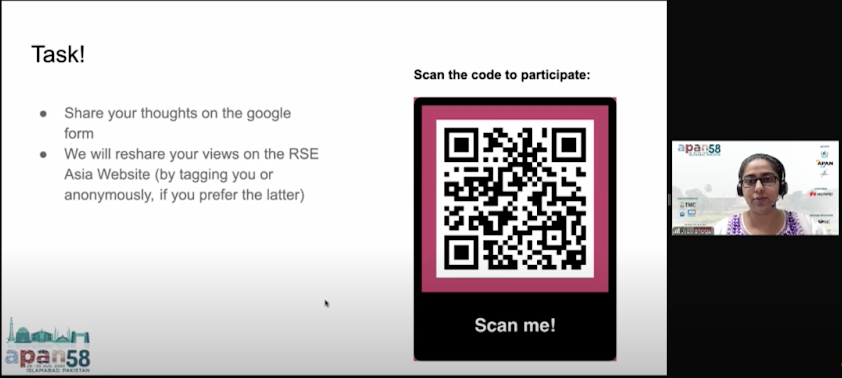
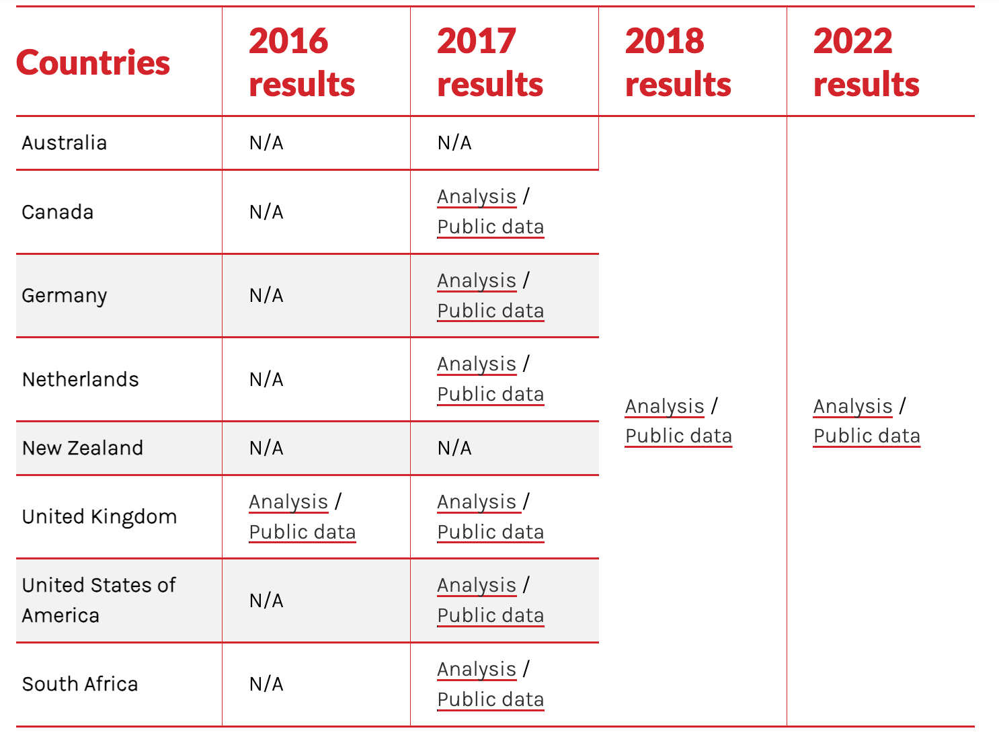

 on [Unsplash](https://unsplash.com/photos/mount-fuji-japan-N4DbvTUDikw?utm_content=creditCopyText&utm_medium=referral&utm_source=unsplash)](david-edelstein-N4DbvTUDikw-unsplash.jpg) 
  
**What is the Asia-Pacific Advanced Network (APAN)?**

APAN is the international partnership of the National Research and Education Networks (NRENs) across the Asia Pacific region. It spans over half of the world’s population, and its members are fundamental in the provision of high-speed network connectivity domestically and globally.

APAN has a number of working groups, one of which is the Open and Sharing Data Working Group (OSDWG). I  became a member of this working group based on the common interest around developing the research software community and its importance in the research ecosystem.

APAN organises biannual meetings bringing together its members and other interested participants to review progress, demonstrate advances in technology and applications, and make plans for the future activities in the Asia Pacific. Over the past months, I got the chance to attend APAN58 and APAN59 meetings, online remotely and exchange knowledge with its stakeholders. In this blog, I am capturing my experiences of attending these meetings.

  

*Source:* [APAN58 : Asia Pacific Open and Sharing Data WG, 27th August 2024, Part 1](https://www.youtube.com/watch?v=giTd8lN88KQ)

During the APAN58 meeting (August 2024), I had the opportunity to present my talk titled ***‘What is Research Software and Why Should we Think About its Sustainability?’*** as part of the Open and Sharing Data Working Group (OSDWG) discussion session. Through my talk, I highlighted the importance of Research Software in the research ecosystem, explaining why it is necessary to think about its sustainability. I shared methods, tools, and best practices that can be utilised to improve the sustainability of research software, following up with the need and the benefits to include techniques for reproducibility in Research Software. Furthermore, I shared what software tools can be used to create, maintain, and share research software (Zenodo, GitHub, GitLab). I spoke about the different types of licenses that can be attached to the outputs of the research. This was followed by a summary of the journey of the [Research Software Engineering (RSE) Asia Association](https://rse-asia.github.io/RSE_Asia/), which I co-founded and co-lead since its launch in 2021\.

🔑 **Talk Resources:**

1. Slides: Jyoti Bhogal. (2024, August 27). What is Research Software and Why Should we Think About its Sustainability?. Zenodo.[https://doi.org/10.5281/zenodo.13377699](https://doi.org/10.5281/zenodo.13377699)  
2. Recording: [APAN58 : Asia Pacific Open and Sharing Data WG, 27th August 2024, Part 1](https://www.youtube.com/watch?v=giTd8lN88KQ) (Clip from 00:00 to 14:55)
<iframe width="560" height="315" src="https://www.youtube.com/embed/giTd8lN88KQ?si=7P9Tu7Kj90rscXgm&amp;start=1" title="YouTube video player" frameborder="0" allow="accelerometer; autoplay; clipboard-write; encrypted-media; gyroscope; picture-in-picture; web-share" referrerpolicy="strict-origin-when-cross-origin" allowfullscreen></iframe>

As I spoke about research software, its definition, the tools to write and maintain it, the audience became curious to know more about research software and the community around it. For the OSDWG session, which focused on topics like Open Science and how research software complements it, my presentation actually gave a keynote kind of a head start to the rest of the talks being presented in the session of OSDWG. 

*Source*: [APAN58 : Asia Pacific Open and Sharing Data WG, 27th August 2024, Part 1](https://www.youtube.com/watch?v=giTd8lN88KQ) 

Towards the end of my talk, I asked the audience to share their feedback to the questions ‘What do you think about research software engineering as a role and as a career path?’ and ‘What are your thoughts on how open science might help the researchers worldwide?’ and received some interesting responses: 

> “Looks interesting, since I have heard about it for the very first time in this talk at APAN58 meeting.”

> “It is necessary for research software engineering management. I’ve heard that the organisations usually do not have enough capacity for managing research software engineers. However, they need software consistently. So, the  public sectors help with this.”

> “It's an innovative way to share research, data and publications, etc.”

> “So many students in the world have a very different situation in their social and life environment. For them, the internet and open science involving open access, open data, open software, and so on will help provide an education and research environment for equality.”

It was nice to see that my talk sparked curiosity in the audience and they promptly provided their feedback of what resonated with them. I also attended sessions on various topics including cybersecurity, high-performance computing & AI, agriculture and rural hybridization, network technologies, telemedicine and research collaborations. These sessions gave me more insights into the latest proceedings in the various fields of research and development in the Asia Pacific region.

In March 2025, I had the opportunity to speak at the **Asia Pacific Advanced Network’s APAN59 meeting** online remotely. My presentation was on the title ***‘Building Bridges: Advancing Research Software Engineering and Open Science in Asia’***. I gave my talk as part of the APAN’s Open and Sharing Data Working Group (OSDWG). Software being one of the pillars of Open Science, through this talk, I highlighted how paying attention towards developing and maintaining research software is directly linked to the principles of Open Science.

Later in March 2025, I had the opportunity to present my talk titled ***‘Building Bridges: Advancing Research Software Engineering and Open Science in Asia’*** at **APAN59,** online remotely again as part of the OSDWG discussion session. Software being one of the pillars of Open Science, through this talk, I highlighted how paying attention towards developing and maintaining research software is directly linked to the principles of Open Science.

During my talk, I shared about my ongoing **Research Study on the Research Software Engineering (RSEng) Landscape in Asia**. I discussed the need of this study \- due to the **no/low representation of the community of researchers who code in the Asian region**. This is demonstrated by the outcomes of an existing global survey by the Software Sustainability Institute, which completely lacks representation from Asia.

Source: Article by SSI: [What do we know about RSEs? Results from our international surveys](https://www.software.ac.uk/blog/what-do-we-know-about-rses-results-our-international-surveys).  

  

Source: Article by SSI: [What do we know about RSEs? Results from our international surveys](https://www.software.ac.uk/blog/what-do-we-know-about-rses-results-our-international-surveys).

I shared the roadmap of my research study with the audience. At the end of my talk, there were quite a few engaging questions. One of the comments from an active member of the APAN biannual meetings was

>“The topic of this research study is something that deals with a national-level problem, thus making it much more essential to be studied.”

The appreciative feedback encourages me to keep taking my research work further.

🔑 **Talk Resources:**

1. Bhogal, J. (2025, March 3). Building Bridges: Advancing Research Software Engineering and Open Science in Asia. Zenodo. [https://doi.org/10.5281/zenodo.15180196](https://doi.org/10.5281/zenodo.15180196)

------------------------------------------------------------------------

### **Learn More About Us**

For more information and to join upcoming events, visit:

#### RSE Asia

- Website: <https://rse-asia.github.io/RSE_Asia/>
- For the latest news, events, activities, and opportunities, follow us on our [LinkedIn page](https://www.linkedin.com/company/rse-asia-association/)
- To join the RSE Asia community, please fill out our short [Community Membership Form](https://docs.google.com/forms/d/1XSxDaTJzcNyGeDYXyJNVg1TDCo7un18PLFNiK6_jL2g/edit)
