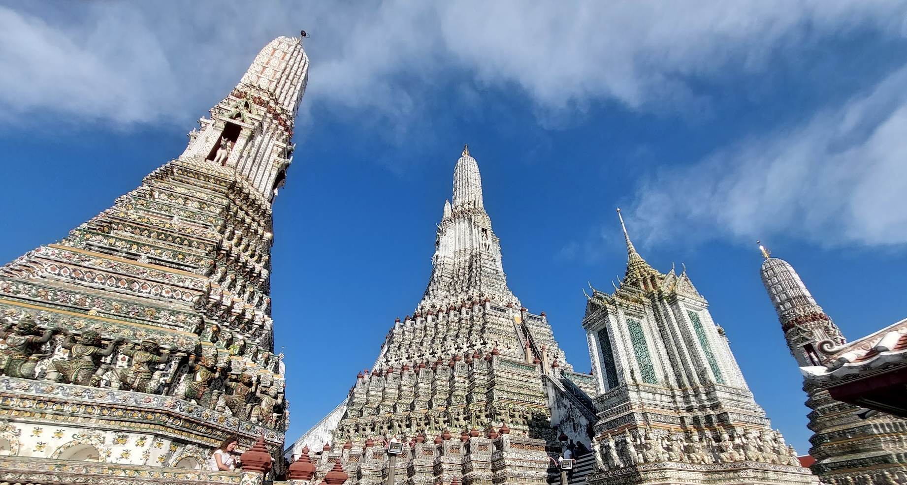
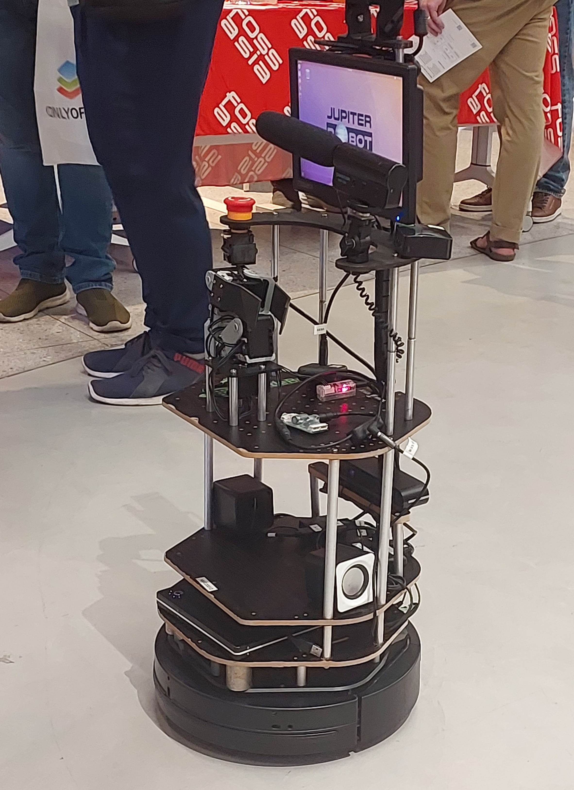
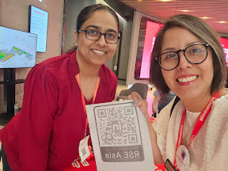
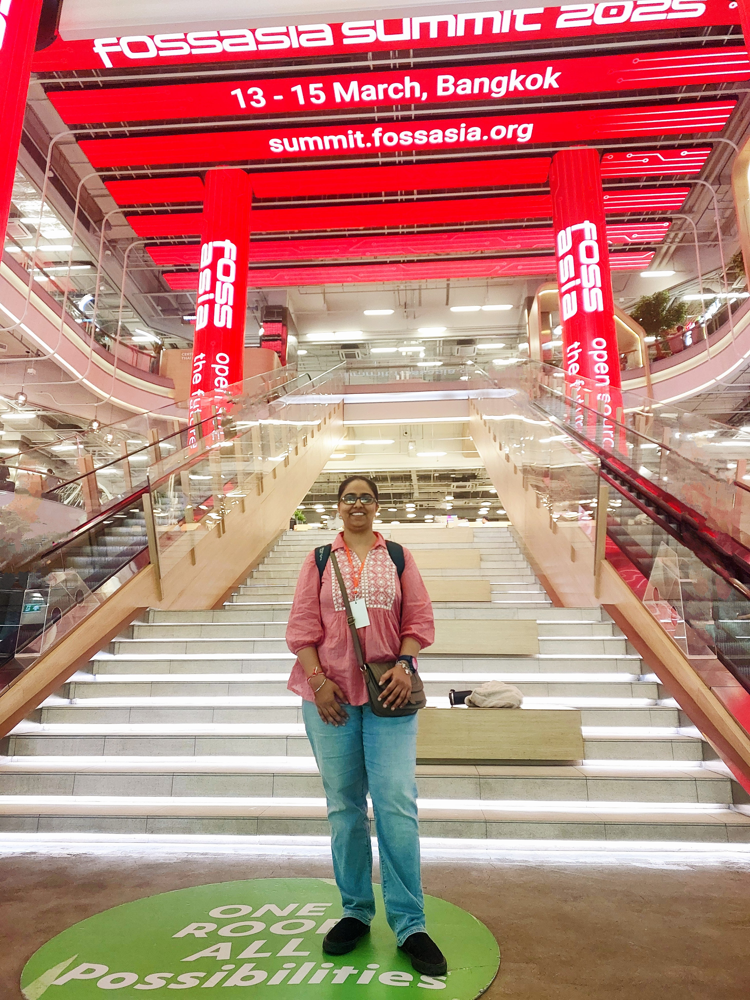
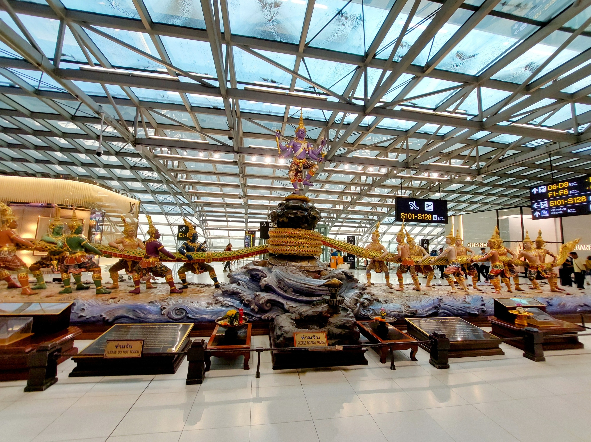
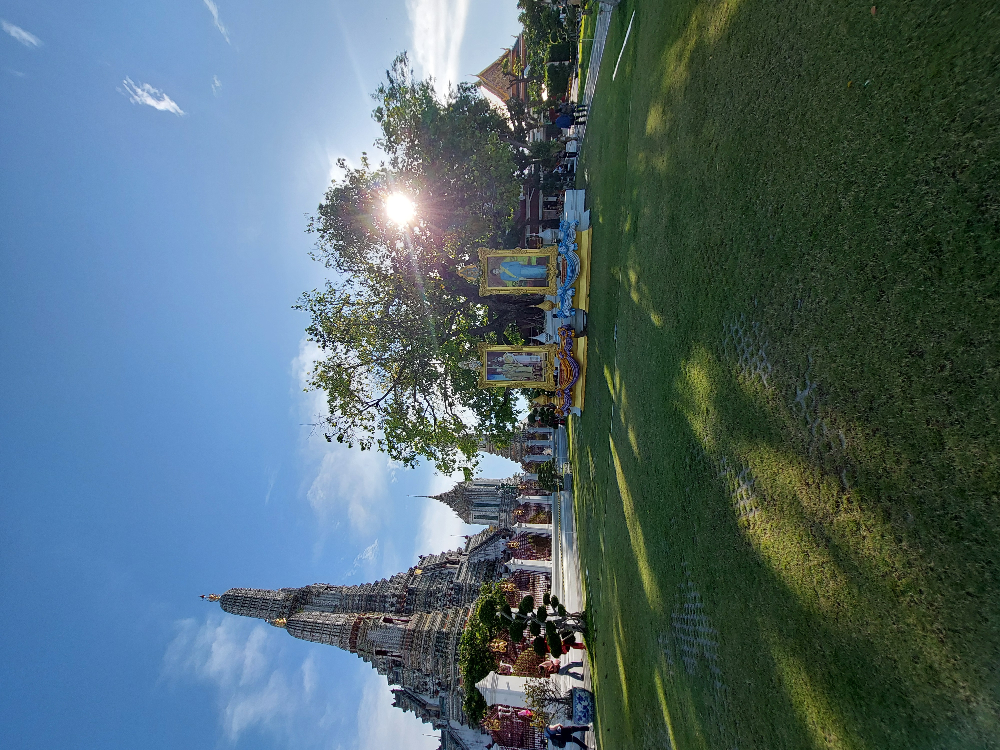
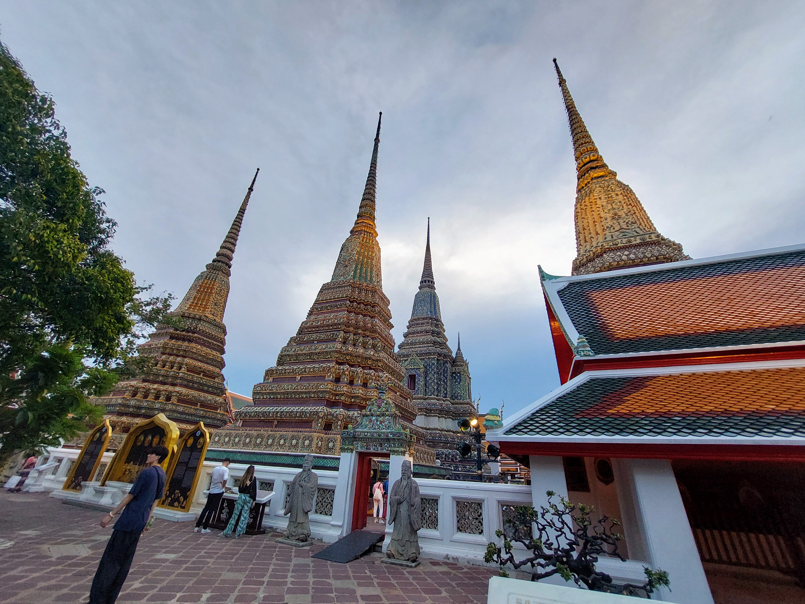
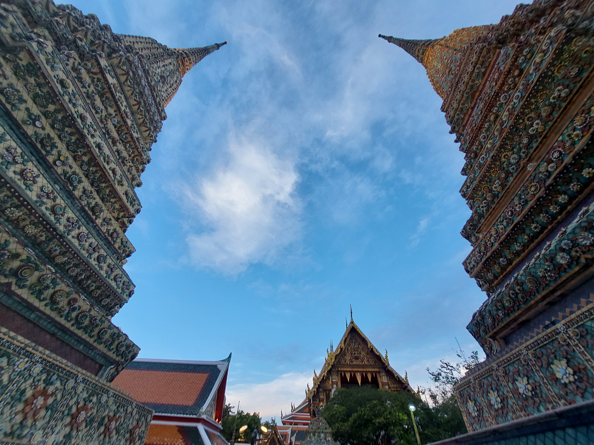

***Swa-dee-kah Bangkok\! 👋🙏***

## 🧑‍💻 What is FOSS?

FOSS, an acronym for Free and Open Source Software, embodies a software development philosophy centered on freedom and openness. The term 'Free' denotes users' liberty to run, alter, and share the software, while 'Open Source' signifies that the software's source code is available for users to inspect, modify, and contribute to its progress. FOSS promotes collaboration, transparency, and user empowerment. This frequently leads to the creation of more secure and sustainable software projects. Notable examples of FOSS include Linux, Blender, Chromium, Kubernetes, and Mozilla Firefox, among many more.

## 🧑‍💻🌏 What is FOSSASIA?

[FOSSASIA](https://fossasia.org/)  is an organisation developing Open Source software applications and Open Hardware together with a global community from its base in Asia. Their goal is to provide access to open technologies, science applications and knowledge that improve people's lives. They enable people to adapt and change technology according to their own ideas and needs, and validate science and knowledge through an Open Access approach. It was established in 2009 by [Hong Phuc Dang](https://www.linkedin.com/in/hongphucdang/) and [Mario Behling](https://www.linkedin.com/in/mariobehling/). They organise and participate in conferences, meetups and code camps. The annual FOSSASIA Summit is one of the top tech events in Asia. FOSSASIA also runs a number of coding programs, such as [Codeheat](https://codeheat.org/).

The [15th edition of FOSSASIA Summit](https://eventyay.com/e/4c0e0c27) was organised at True Digital Park, Bangkok, Thailand from 13th to 15th March 2025\.  It brought together individuals sharing talks on topics around Free and Open Source Software. The Summit had multiple parallel track sessions like talks, lightning talks, workshops, and more\! There were booths by various organisations creating and/or using Free and Open Source Software.  This was my first experience of attending FOSSASIA in-person in Thailand.

## 🗓️ Day 1

The day started with a lot of fervour. Following the welcome session by Hong Phuc Dang, there were multiple parallel tracks of talks. One of the booths demonstrated ***Robot Jupiter*** (image below) \-  an interactive virtual education assistant\!

I had a chance to speak to Nancy Reyes, a representative from the  [A11y Accessibility Labs](https://www.a11ylab.com/). She was showcasing the hardware items that they use for digital accessibility awareness training during their Usability and Accessibility Clinic sessions.  

*A picture with [Nancy Reyes](https://www.linkedin.com/in/nancyreyesfl/), from the [A11y Accessibility Labs](https://www.a11ylab.com/), speaking about the mission of the RSE Asia Association.*

## 🗓️ Day 2

The second day of the summit, 14th March, was themed as PGDay 2025, a 1-day event focused on the PostgreSQL database, which was held in conjunction with the FOSSASIA Summit. I learnt about a new tool \- [pgroll](https://pgroll.com/). It is an open-source command-line tool designed for PostgreSQL, ensuring that schema updates are applied safely, without locking the database, and enabling multiple schema versions to coexist. This ensures uninterrupted operation for client applications during migration, even when introducing breaking changes. The tool’s capability to automatically backfill columns and support instant rollbacks further enhances its reliability.

Later that day, I came across the booth of [Grafana Labs](https://www.linkedin.com/company/grafana-labs/). As I spoke to [Richard Hartmann](https://www.linkedin.com/in/richih/), he shared about the useful features of Grafana Labs tools for creating reports, metrics, and graphs about the code being written.

## 🗓️ Day 3

I held a ‘***Meet & Greet Spot***’ to speak to people about the field of Research Software Engineering, and discussed how it is a career path where one can combine their interest in implementing their research skills along with programming skills. I also shared about the past and the upcoming activities of the [Research Software Engineering (RSE) Asia Association](https://rse-asia.github.io/RSE_Asia/). Most people were curious to learn more about it, and also expressed a desire to join the future events held for the community.

## 👥 Cultural Warmth

From the moment I arrived at the Suvarnabhumi airport, I found everyone to be warm and welcoming. People at help desks, metro ticket counters, and even local markets were kind and helped me get around the city easily. I also learned something new about Thailand — it's a pedestrian-first country, where vehicles stop to let people cross the road. Another thing I noticed was a good gender balance in the different workplaces that I came across.

With fresh fruits like mangoes, jackfruits, bananas, guavas, cashews, and coconuts, I truly experienced the tropical feel of the country. I enjoyed trying different types of bread, like red bean and almond bread. I also got to taste authentic Pad Thai noodles and Veg Thai Curry at a restaurant in True Digital Park. A fellow participant at the conference even taught me how to use chopsticks practically. I found Bangkok’s infrastructure very supportive for growth, with great workspaces and plenty of learning resources to help you make your own impact. Everyone I met — from the conference team to the hotel staff — was friendly and helpful, making the city feel not just a hub to flourish businesses and communities, but a place that warmly welcomes you again and again.

Here’s a glimpse of Bangkok through my eyes\!  

## 📕 My takeaway …

FOSSASIA Summit 2025 was especially close to my heart because it rekindled in me the spirit, zeal, and dedication towards contributing back to the software that we, knowingly or unknowingly, use on a day-to-day basis. As I left Thailand to return home, I carried so many learnings with me \- especially the power that the voice of a community has\!

With that, I am concluding this blog until next time …

------------------------------------------------------------------------

### **Learn More About Us**

For more information and to join upcoming events, visit:

#### RSE Asia

-   Website: <https://rse-asia.github.io/RSE_Asia/>
-   For the latest news, events, activities, and opportunities, follow us on our [LinkedIn page](https://www.linkedin.com/company/rse-asia-association/)
-   To join the RSE Asia community, please fill out our short [Community Membership Form](https://docs.google.com/forms/d/1XSxDaTJzcNyGeDYXyJNVg1TDCo7un18PLFNiK6_jL2g/edit)