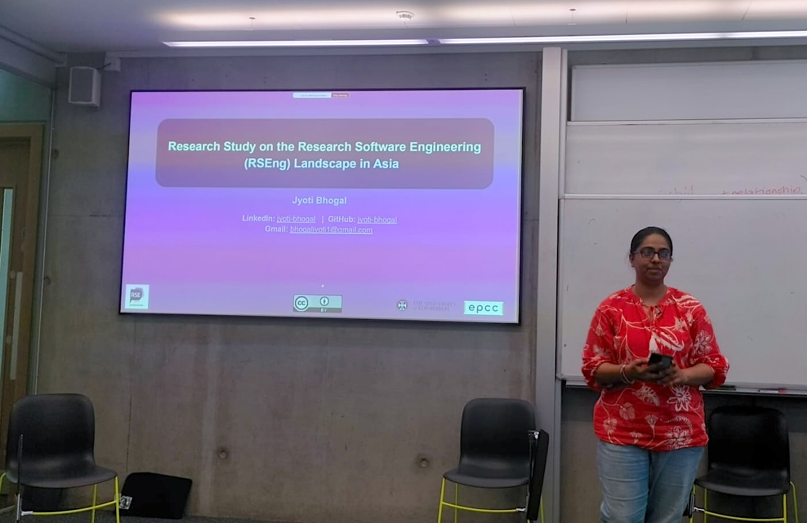

As part of my SSI Fellowship project, I was invited to visit [EPCC at the University of Edinburgh](https://www.epcc.ed.ac.uk/) and give a talk about my work. This was following my participation in the [Collaborations Workshop 2025](https://www.software.ac.uk/workshop/collaborations-workshop-2025-cw25) organised by the [Software Sustainability Institute (SSI)](https://www.software.ac.uk/) at the [University of Stirling](https://www.stir.ac.uk/). I was joined by SSI Fellows **Samantha Wittke** and **Saranjeet Kaur**.

On the day, **Catherine Inglis** and **Neil Chue Hong** welcomed us to the [Bayes Centre at EPCC](https://bayes-centre.ed.ac.uk/). The robots on the ground floor of the Bayes Centre are hard to miss, and I must say, I was captivated by them\! We all went on a tour of the EPCC building and met several members of the team there. Later, we stepped out and had a lunch break in the beautiful and sunny campus of the University of Edinburgh. It was during the chats with Catherine and Neil, I got to know that the Unicorn 🦄 \- an imaginary creature \- is the National Animal of Scotland, and then it made sense to me why the buildings in Edinburgh have so many unicorn statues\! 

There were two talks planned for the day. The first one was by Samantha, who shared about the [CodeRefinery](https://coderefinery.org/) project and her work with the [Nordic RSE](https://nordic-rse.org/). Later, I presented my talk on the ongoing ‘Research Study on the Research Software Engineering (RSEng) Landscape in Asia’. Coincidentally, there were a few common points touched during both the talks \- maybe CodeRefinery and RSE Asia could collaborate more closely in the future, but for now, I will focus this blog on my talk\! 😊

  

# What is RSE Asia?

We (I and my co-Founder **Saranjeet Kaur**) launched the [Research Software Engineering Asia Association (RSE Asia)](https://rse-asia.github.io/RSE_Asia/) back in 2021, on the [very first International RSE Day](https://researchsoftware.org/council/intl-rse-day.html), as there was almost no awareness about Research Software Engineering in the Asian region. Over the past 3+ years we have conducted and participated in various events and workshops to raise awareness about the profession and the community. Based on the reflections over this period, I started to explore the RSE landscape in the Asian region to get better informed insights.

# What is my project about?

The motivation for this project was gained after reflecting over several of the community initiatives and interactions that RSE Asia had with the community in the region. I was further encouraged to take this work ahead when I proposed the idea during my talk on ‘[What is Research Software and Why Should we Think About its Sustainability?](https://jyoti-bhogal.github.io/about-me/talks/2025-03-30_apan58/)’ at the 58th meeting of the Asia Pacific Advanced Network (APAN58) during August 2024, which was attended by delegates from across Asia Pacific as well as the globe. I have been developing this idea since then, and have been encouraged and supported to do so by several RSE community members, SSI fellows, and community leaders. 

Speaking of why this study is required \- this study is essential for several reasons, some of which are the need to diversify and expand the research software landscape, attempt to address the lack of formal RSE roles in Asia, leverage international partnerships, and further build a supportive community within Asia.

SSI has been conducting surveys to study the RSE landscape since 2018\. However, there has been almost no representation of Asia in these surveys. This makes my research study even more essential. 

.*](ssi_survery_map.png)  

Within Asia, the Asia-Pacific Advanced Network (APAN) is an organisation that represents member institutions as well as it is a backbone network connecting member countries and regions to each other and to other international research and education networks. I am a member of APAN’s [Open and Sharing Data Working Group (OSDWG)](https://apan.net/elements/working-groups/open-sharing-data/). This working group engages in dialogue and activities to promote good open science practices within research roles/institutes in the Asia Pacific. RSE Asia has had a consistent voice and representation during the biannual APAN meetings as a part of this working group. Through these engagements we realised the common interests we share with the working group and their intentions to help support the objectives of RSE Asia. Asia being a very complex and diverse region both, culturally and economically, it is essential to have the support from an established working group like the APAN’s OSDWG so as to have a better understanding of the research software landscape in the region.

.*](apan_current_members.png)

So far in this project, I have been able to refine and adapt the existing SSI surveys to make them suitable for the Asian context. I have also launched a pilot survey with a small group in APAN’s OSDWG to gain first-hand feedback on the survey so far. Next, I plan to refine the survey further based on this feedback before launching the full survey to a larger group. If you are either a researcher based in Asia or have worked in the Asian region or collaborate with colleagues in Asia, then please watch the [RSE Asia page](https://www.linkedin.com/company/rse-asia-association/?viewAsMember=true) for updates about my project and the survey \- I would love to hear from you\!

# 🎉 Concluding the day

After the talks, we spent some time discussing our work with the audience, which smoothly transitioned into EPCC’s ritual of ‘Friday Buns’. We discussed the challenges and way forward. Later that evening, I walked up the Calton hill (recommended by many) and got to see a 360° view of the city, the valleys, as well as the beautiful North Sea. Being a bright, sunny day, with the sun setting almost post 10 pm, I went for a walk to the Portobello Beach, and loved every bit of it\!

I sincerely want to thank **Neil Chue Hong** for inviting me to EPCC and to **Catherine Inglis** for all the hospitality she offered. Last but definitely not least, a big thanks to **Sohail Sukhiani** and **Oscar Seip** for offering me a lot of behind-the-scenes support. I immensely value this opportunity of personal and professional growth\!

## 🔑 Resources:

**Talk slides:** [https://zenodo.org/records/15450346](https://zenodo.org/records/15450346)

### **Learn More About Us**

For more information and to join upcoming events, visit:

#### RSE Asia

-   Website: <https://rse-asia.github.io/RSE_Asia/>
-   For the latest news, events, activities, and opportunities, follow us on our [LinkedIn page](https://www.linkedin.com/company/rse-asia-association/)
-   To join the RSE Asia community, please fill out our short [Community Membership Form](https://docs.google.com/forms/d/1XSxDaTJzcNyGeDYXyJNVg1TDCo7un18PLFNiK6_jL2g/edit)
