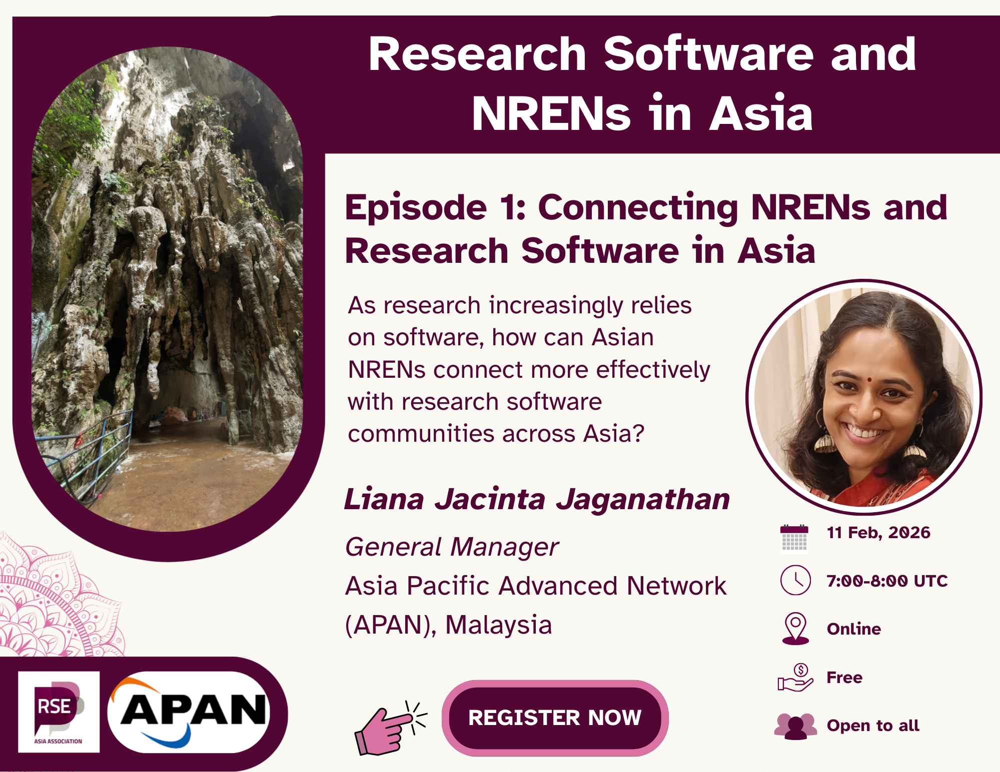

  
---
title: "Research Software and NRENs in Asia: Episode 1 - Connecting NRENs and
Research Software in Asia"
subtitle: "This blog post summarizes the first episode of the Research Software
and NRENs in Asia series, featuring a conversation with APAN’s General Manager,
Liana Jacinta Jaganathan."
date: 2026-02-27
authors:
  - "Jyoti Bhogal"
  - "Liana Jacinta Jaganathan"
  - "Saranjeet Kaur"
  
categories:
  - Research Software Engineering
  - Community Building
  - National Research and Education Networks (NRENs)
  - Asia
summary: "This blog post summarizes the first episode of the Research Software
and NRENs in Asia series, featuring a conversation with APAN’s General Manager,
Liana Jacinta Jaganathan."
image:
  preview_only: true
  filename: "rs_nren_series_banner_episode_1.png"
draft: false
---

On the [International Day of Women and Girls in Science](https://www.unesco.org/en/articles/2026-international-day-women-and-girls-science)**,** 11 February 2026, the
[RSE Asia Association](https://rse-asia.github.io/RSE_Asia/) launched a new
community conversation series on [***Research Software and NRENs in Asia***](https://rse-asia.github.io/RSE_Asia/event/). This series is a part of a MoU between RSE Asia and the
[Asia Pacific Advanced Network (APAN)](https://apan.net/). The series aims to
explore how research software, infrastructure, and regional collaboration
intersect across the Asia-Pacific region.

In this first episode, co-founders
[Jyoti Bhogal](https://www.linkedin.com/in/jyoti-bhogal) and
[Saranjeet Kaur](https://www.linkedin.com/in/saranjeet-kaur-b-48ab769b/)
welcomed APAN’s General Manager,
[Liana Jacinta Jaganathan](https://www.linkedin.com/in/lianajacinta/), to chat
about the origins of APAN, its evolving mission, and the growing importance of
research software engineers (RSEs) in the regional research ecosystem.

## **What is APAN? Why and how was it created?**

APAN was established in the late 1990s as a strategic response to the growing
need for cross-border digital research collaboration. As data-intensive science
began to transcend national boundaries, it became clear that individual
countries could not fully realise their research potential in isolation.

Today, APAN is a consortium of 24 members, primarily National Research and
Education Networks (NRENs) within Asia, alongside associates outside Asia and,
recently, industry members too. While NRENs provide high-performance network
infrastructure, APAN acts as a collaborative platform for bringing economies
together to share resources, expertise, and innovation.

From its early foundations, championed by Japan, Korea, Australia, and
Singapore, APAN has grown into a vibrant, multi-layered community. It began as
a focus on connectivity and has evolved into a broader mission to enable
meaningful and impact-driven collaboration.

APAN has multiple Working Groups under the two heads \- Technology and
Application. Some of the first working groups were those for agriculture,
telemedicine, and network engineering.

## **Infrastructure needs content: Why Research Software matters**

A powerful metaphor from Liana captured the essence of the discussion:

> Infrastructure without software is like a highway without vehicles.

High-speed networks alone are not enough. Without research software, data
pipelines, simulations, gateways, and analysis tools, the infrastructure
remains underutilised.

Research software engineers play a critical bridging role. They transform raw
connectivity into actionable knowledge. They build the engines that move data
across systems and turn bandwidth into insight. As Liana emphasised, RSEs
translate “bit transport” into “knowledge-level insight.”

For the APAN and for the broader research ecosystem, this makes the research
software community not optional, but essential.

## **Open science and cross-border collaborations**

One of the highlights of the discussion was APAN’s
[Open Science Collaborative and Resource Working Group (OSCR)](https://apan.net/elements/working-groups/oscr/),
formerly known as the Open and Sharing Data Working Group.

This group brings together experts across the various working groups of APAN
(like agriculture, disaster mitigation, telemedicine, and more). Liana shared
about collaboration on open data and open science not only within Asia, but
also beyond. These collaborators include France, Sri Lanka, Thailand,
Indonesia, and UNESCO. These collaborations demonstrate how data-intensive
disciplines can converge through shared platforms.

Cross-border collaboration is embedded in APAN’s DNA. Through connections with
global partners such as the [GÉANT](https://geant.org/),
[Internet2](https://internet2.edu/), and
[UbuntuNet Alliance](https://www.ubuntunet.net/), APAN acts as a critical node
in the global research network architecture.

Importantly, inclusivity remains central. Through fellowship programs and
capacity-building initiatives, APAN ensures that researchers from developing
economies have equitable opportunities to participate and lead.

## **The future: From connectivity to impact**

Over the last two decades, NRENs have shifted from being *‘pipe providers’* to
becoming *‘service orchestrators’*. Today, conversations are no longer about
bandwidth alone, but about how networks can help solve real-world problems
like:

- Predict disasters

- Address water and climate crises

- Enable AI and quantum computing

- Support telemedicine and public health

- Reduce carbon footprints through green computing and sustainable software

When we discussed the emerging opportunities for research software engineers,
Liana shared about multiple avenues, including:

- Open-source AI development

- Quantum-safe infrastructure

- Security and privacy engineering

- Sustainability-driven (green) software engineering

- Data integration across environmental, human, and animal systems

The ecosystem is becoming symbiotic. Software increasingly defines how networks behave in real time. As infrastructure becomes programmable, the boundary between network and software continues to dissolve.

## **Leadership, community, and human connections**

Reflecting on her 20-year journey with APAN, from being a network engineer to the General Manager, Liana described APAN as a second family. What excites her most is not just technological evolution, but ***the people***.

APAN meetings now showcase real-world impact \- from telemedicine programs with hundreds of participants to disaster mitigation initiatives like those responding to floods in Sri Lanka. The question has shifted from  

> How many gigs does your network have?

to

> How does your network solve real-world problems?

This evolution mirrors the aspirations of the research software community
itself.

## **Advice for young researchers and RSEs**

When asked for one piece of advice for young researchers and developers in
Asia-Pacific, Liana offered a powerful closing thought:

> Don’t just build for your organisation. Build for the ecosystem.

This message resonated deeply with the spirit of the series.
Research software is not just code \- it is an infrastructure for
collaboration, resilience, and shared progress.

## **What’s next?**

The conversation continues\! The second episode will feature
[Dr. Veerachai Tanpipat](https://www.linkedin.com/in/veerachai-tanpipat-5a7022304/),
who leads several APAN working groups (agriculture, disaster mitigation, and
the Open Science Collaborative and Resource (OSCR)).

Meanwhile, RSE Asia encourages community members to:

- Participate in the ongoing [research software landscape survey in Asia](https://docs.google.com/forms/d/e/1FAIpQLSeLWbwy2vL67b-Qxjf3VRsRvYFBfH0_r7Zs4YhkX4A3I_0L3w/viewform), which is open until 31st March 2026\. You also stand a chance to win a cash prize of £10 for 5 participants based on a raffle.  
- Register for [Episode 2: Research Software and Environmental Research in Asia](https://us06web.zoom.us/meeting/register/JGnHlnKZSr-vg-e7xMyumg#/), where we welcome [Dr. Veerachai Tanpipat](https://www.linkedin.com/in/veerachai-tanpipat-5a7022304/), Senior Expert, Hydro Informatics Institute, Thailand, with whom we discuss open science practices and how they help to solve real-world problems with the APAN infrastructure.   
- Join the RSE Asia [Community Membership](https://docs.google.com/forms/d/e/1FAIpQLSci4FOE7wBeDJQowDSmweujLhJFfzr2rut46yKJc0agkE7Jug/viewform?usp=header) to get the latest news.  
- Follow [RSE Asia](https://www.linkedin.com/company/rse-asia-association/) on LinkedIn for updates and opportunities

This kickoff episode made one thing clear: when research software,
infrastructure, and community align, the possibilities extend far beyond
connectivity.

They shape the future of research across Asia and beyond.

## **Resources:**  

If you were not able to join the meetup live or would like to revisit it,
here’s the [***YouTube video recording***](https://www.youtube.com/watch?v=9GFiXWLxUz0)
of the episode. Throughout the meetup, the guest, the facilitators, and the
participants shared a bunch of useful resources for the community for shared
progress. We have compiled it in the form of a Resource Sheet. Definitely,
check it out\!

***Resource sheet:*** [***Zenodo link***](https://docs.google.com/document/d/1_rr9OjIcZumh_U9Sz97Fh3TmZmAaT7s_f7boWlR7u2w/edit?tab=t.0#heading=h.mrjcpkv71a4)

------------------------------------------------------------------------

### **Learn More About Us**

If you have any questions about, please reach out to us at:
rse.asia.association@gmail.com.
For more information and to join upcoming events, visit:

- Website: <https://rse-asia.github.io/RSE_Asia/>
- For the latest news, events, activities, and opportunities, follow us on our [LinkedIn page](https://www.linkedin.com/company/rse-asia-association/)
- To join the RSE Asia community, please fill out our short [Community Membership Form](https://docs.google.com/forms/d/e/1FAIpQLSci4FOE7wBeDJQowDSmweujLhJFfzr2rut46yKJc0agkE7Jug/viewform?usp=header)
