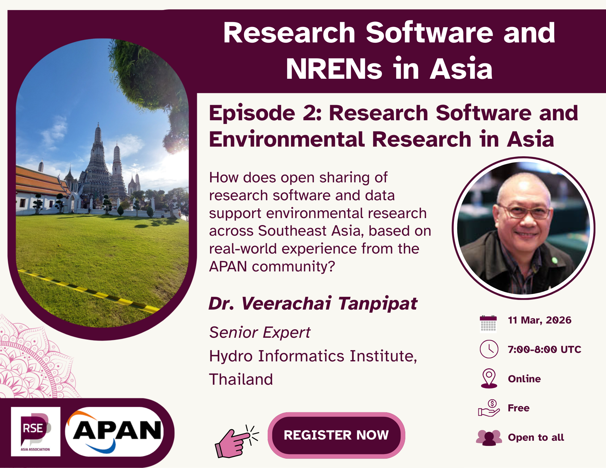

  
---
title: "Research Software and Environmental Research in Asia"
subtitle: "This blog post summarises the second episode of the Research
Software and NRENs in Asia series, featuring a conversation with Dr. Veerachai
Tanpipat, Senior Expert at the *Hydroinformatics Institute*, Thailand."
date: 2026-03-20
authors:
  - "Jyoti Bhogal"
  - "Veerachai Tanpipat"
  - "Saranjeet Kaur"
  
categories:
  - Research Software Engineering
  - Environmental Research
  - Open Science
  - Open Data
  - Open Source Software
  - Research Infrastructure
  - National Research and Education Networks (NRENs)
  - Asia
summary: "This blog post summarises the second episode of the Research Software
and NRENs in Asia series, featuring a conversation with Dr. Veerachai Tanpipat,
Senior Expert at the *Hydroinformatics Institute*, Thailand."
image:
  preview_only: true
  filename: "rs_nren_series_banner_episode_2.png"
draft: false
---

Asia has a rapidly growing research ecosystem, but the research software
community remains relatively scattered. By connecting people across
institutions and countries, this series helps build awareness of how research
software, infrastructure, and open science practices intersect.
The series also highlights how NRENs play a critical role in enabling
large-scale research collaboration, particularly in data-intensive fields like
environmental science.

The second episode of the
[**Research Software and NRENs in Asia**](https://rse-asia.github.io/RSE_Asia/event/)
community conversation series brought together researchers, research software
practitioners, and infrastructure experts to explore how research software
supports environmental research across Asia. This series is organised by the
[**RSE Asia Association**](https://www.linkedin.com/company/rse-asia-association/)
in collaboration with the
[**Asia Pacific Advanced Network (APAN)**](https://www.linkedin.com/company/apan-net/)
as part of their Memorandum of Understanding (MoU) activities.

The session featured
[**Dr Veerachai Tanpipat (also known as Chai)**](https://www.linkedin.com/in/veerachai-tanpipat-5a7022304/), Senior Expert at the [*Hydroinformatics Institute*](https://www.linkedin.com/company/hydroinformatics-institute/) in Thailand and chair or co-chair of several APAN
Working Groups (WGs). This includes being the Chair of the
[Open Science Collaborative and Resource WG](https://apan.net/elements/working-groups/oscr/),
and a co-chair of the Agriculture WG and the Disaster Mitigation WG. The
discussion focused on environmental data sharing, disaster mitigation, the role
of research software, and the challenges of building sustainable research
infrastructure in a diverse region like Asia. The Agriculture WG focuses on
using technology to support sustainable food production across the Asia-Pacific
region. He emphasised how each of these is interrelated, and that in order to
solve the problems in any of these areas, the researchers, as well as the
software developer, should gain an understanding of the different disciplines.
The APAN is a long-standing collaboration of the NRENs across the Asia-Pacific
region. While the network infrastructure itself is critical, Dr. Tanpipat
emphasised that applications built on top of these networks are increasingly
important. Today, research collaborations depend not only on connectivity but
also on software, data systems, and collaborative tools.

This blog summarises the key insights from the session.

## **Disaster mitigation and environmental data collaboration**

One of the most interesting parts of the discussion centred on the
**Disaster Mitigation working group**. Asia experiences frequent environmental
disasters, including floods, typhoons, earthquakes, wildfires, and tsunamis.
To respond effectively, researchers must combine data from multiple sources,
including satellite imagery, remote sensing data, ground sensors, weather
models, and hydrological measurements.

Historically, remote sensing data has been extremely large and difficult to
move across networks. However, modern NREN infrastructure now allows large
datasets to be transferred quickly for analysis.

International initiatives also support these efforts. For example, the
[**Copernicus programme**](https://www.copernicus.eu/en) funded a satellite
data centre in the Philippines to support environmental monitoring across
ASEAN countries. The second phase of the project will focus more heavily on
**applications and data analysis**, rather than simply building infrastructure.

Similarly, high-performance computing infrastructure such as that supported by
the [**Korea Institute of Science and Technology Information (KISTI)**](https://www.kisti.re.kr/eng/)
provides computational resources for ASEAN environmental research at the
[National Research and Innovation Agency (BRIN)](https://www.brin.go.id/en).

These collaborations enable near-real-time processing of disaster data across
international research networks.

## **The role of research software**

A central theme of the conversation was the role of **research software** in
environmental research.

Environmental science increasingly depends on software systems that process
large satellite datasets, integrate multiple data sources, run predictive
models, and generate dashboards for decision makers.

Dr Chai highlighted that many scientists understand the scientific models but
may not have the programming expertise to build robust software systems. This
creates a strong need for collaboration between
**domain scientists and software engineers**.

In some projects, computer science students from France have helped implement
web applications for operational use by
[government agencies and NGOs](https://wildlandfire.thairen.net.th/landfirealertsmap_thailand/).
These applications can support activities such as wildfire monitoring or flood
forecasting which is looked after by the
[National Hydroinformatics Centre of Thailand](https://www.thaiwater.net/).

However, sustainability remains a major issue. A recurring problem is a
**lack of documentation**. When students or short-term contributors leave a
project without proper documentation, the software becomes difficult to
maintain or extend.

This challenge highlights the importance of good software engineering practices
in research.

## **The critical importance of data quality**

Another key takeaway from the session was that
**data quality is the foundation of reliable environmental research**.

Dr Tanpipat summarised this with a familiar principle:

> “Garbage In, Garbage Out, GIGO."

No matter how sophisticated an algorithm may be, poor input data will produce
unreliable results.

Environmental datasets often come from multiple sources, such as satellite
sensors, ground monitoring stations, citizen science contributions, and IoT
sensors.

Each source has different levels of accuracy. For example, low-cost air-quality
sensors may cost USD 20-30, while high-precision instruments can cost hundreds
or thousands of dollars.

When researchers combine these datasets without understanding the differences
in measurement accuracy, the resulting analysis can be misleading.

## **Challenges in data sharing and open science**

Despite growing interest in open science, sharing research data remains
difficult.

Researchers often hesitate to share their datasets for several reasons like the
fear that others may publish different results using the same data, concerns
about sensitive or confidential information, Institutional or national policies
restricting access, Lack of incentives for sharing data, and the effort
required to prepare data for sharing (e.g., cleaning, documentation).

These concerns create barriers to implementing **FAIR data principles**
(Findable, Accessible, Interoperable, Reusable).

Dr Chai noted that funding agencies are increasingly requiring researchers to
upload their datasets to public repositories. However, cultural change takes
time, and many institutions are still adapting to these expectations.

## **AI, synthetic data, and research integrity**

The discussion also touched on the role of **AI and generative technologies**
in environmental research.

AI can help to generate synthetic datasets for testing models, accelerate code
development, and Support predictive modelling.

However, there are also risks. AI-generated data may appear realistic, but
could contain inaccuracies or fabricated information.

For this reason, researchers must clearly document the origin of their data,
whether AI was used to generate or modify datasets, the limitations of the
data.

Metadata and documentation are essential for maintaining trust in research
outputs.

## **Skills for future researchers and research software engineers**

For early-career researchers interested in working at the intersection of
environmental science and research software, several skills are particularly
valuable.

**1\. Strong programming skills**

Researchers should develop the ability to write efficient and maintainable
code.

**2\. Cross-disciplinary understanding**

Software engineers working in environmental research must understand the
scientific context behind their tools.

For example, understanding hydrology, forestry, weather systems, and GIS and
remote sensing helps developers design better tools for real-world
applications.

**3\. Systems thinking**

Environmental systems are complex and interconnected. Researchers must develop
the ability to connect information across disciplines.

**4\. Continuous learning**

Environmental research evolves rapidly, and researchers must constantly update
their knowledge.

## **Looking ahead**

The session highlighted both the **opportunities and challenges** in building
sustainable environmental research infrastructure in Asia.

Key priorities include:

- Improving access to high-quality environmental data  
- Encouraging open science practices  
- Strengthening collaborations between scientists and software engineers  
- Investing in sustainable research software development  
- Building cross-disciplinary skills among researchers

Environmental challenges such as climate change, extreme weather, and natural
disasters will only grow in importance in the coming decades. Addressing them
requires strong collaboration across countries, disciplines, and technologies.

As Dr. Chai concluded during the session:

> We are in different boats, but we are in the same storm.

Collaboration across the Asia-Pacific research ecosystem will be essential for
building resilience and developing sustainable solutions.

## **Participate in the RSE Asia landscape survey**

To better understand the state of research in software engineering across the
region, the **RSE Asia Association** has launched a landscape survey. The
survey aims to collect insights about career paths, challenges, and
opportunities for research software professionals in Asia.

The survey is open until **31 March**, and participants will be entered into a
raffle for a **£10 prize**.

## **What’s next?**

In April, we will have a Community Webinar that features
[Mohamad Mostafa](https://www.linkedin.com/in/mohamad-mostafa/), Community
Specialist, DataCite, UAE.

Meanwhile, RSE Asia encourages community members to:

- Participate in the ongoing
[research software landscape survey in Asia](https://docs.google.com/forms/d/e/1FAIpQLSeLWbwy2vL67b-Qxjf3VRsRvYFBfH0_r7Zs4YhkX4A3I_0L3w/viewform),
which is open until 31st March 2026\. You also stand a chance to win a cash
prize of £10 for 5 participants based on a raffle.  

- Register for the community webinar on
[Connecting Research Software to the Scholarly Record with DataCite](https://rse-asia.github.io/RSE_Asia/event/2026-04-14_datacite_webinar/), where we welcome [Mohamad Mostafa](https://www.linkedin.com/in/mohamad-mostafa/), Community Specialist, DataCite, UAE, with whom we will
discuss how DataCite’s open PID infrastructure and rich metadata support the
persistent identification and discoverability of research software.  
- Join the RSE Asia [Community Membership](https://docs.google.com/forms/d/e/1FAIpQLSci4FOE7wBeDJQowDSmweujLhJFfzr2rut46yKJc0agkE7Jug/viewform?usp=header)
to get the latest news.  
- Follow [RSE Asia](https://www.linkedin.com/company/rse-asia-association/) on
LinkedIn for updates and opportunities.

## **Resources:**

If you were not able to join the meetup live or would like to revisit it, the
***video recording*** of the episode is coming soon. Throughout the meetup, the
guest, the facilitators, and the participants shared a bunch of useful
resources for the community for shared progress. We have compiled it in the
form of a Resource Sheet. Definitely, check it out\!  

**Resource sheet:** Zenodo link coming soon\!

------------------------------------------------------------------------

### **Learn more about us**

If you have any questions about, please reach out to us at:
rse.asia.association@gmail.com.
For more information and to join upcoming events, visit:

- Website: <https://rse-asia.github.io/RSE_Asia/>
- For the latest news, events, activities, and opportunities, follow us on our
[LinkedIn page](https://www.linkedin.com/company/rse-asia-association/)
- To join the RSE Asia community, please fill out our short
[Community Membership Form](https://docs.google.com/forms/d/e/1FAIpQLSci4FOE7wBeDJQowDSmweujLhJFfzr2rut46yKJc0agkE7Jug/viewform?usp=header)
