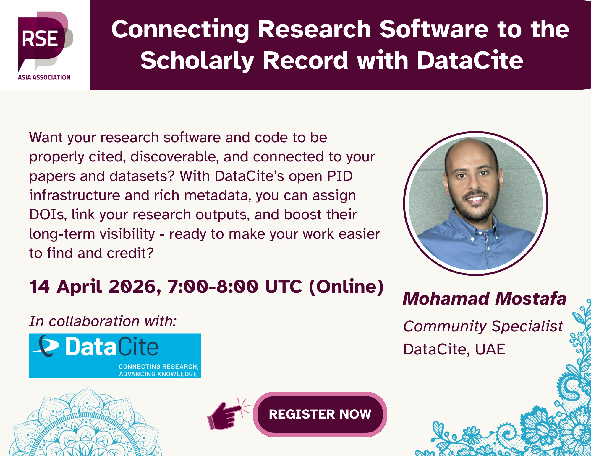
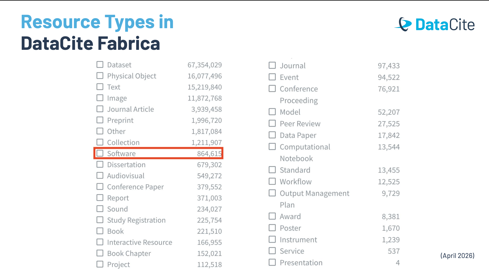
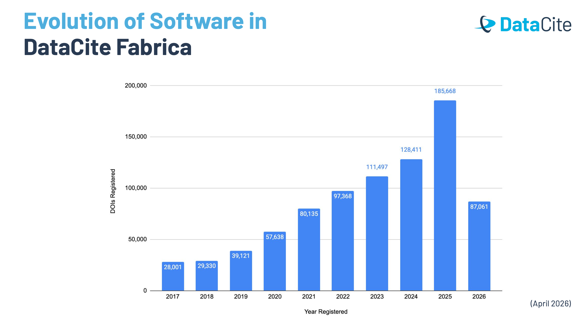
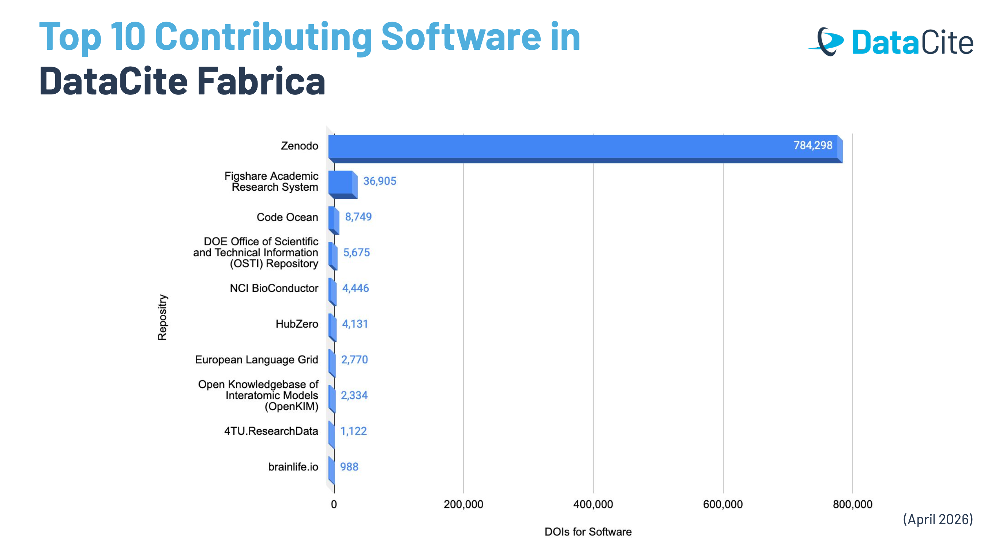
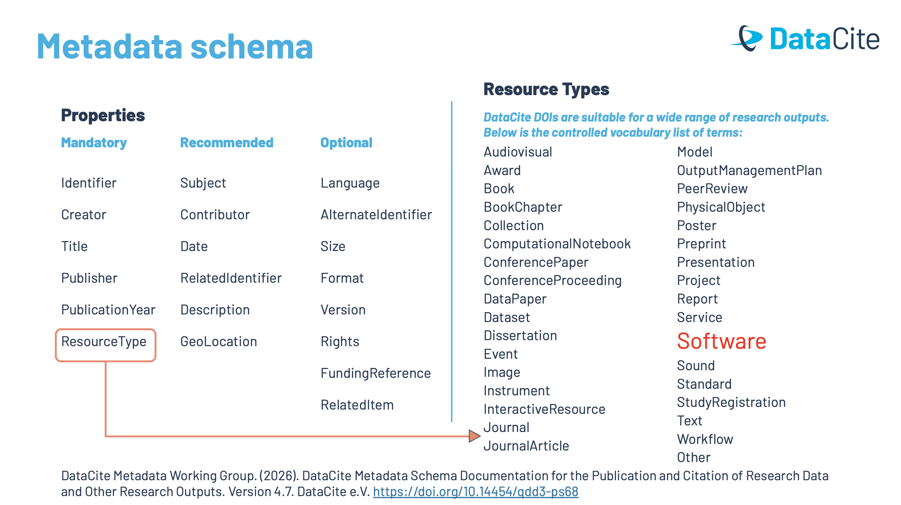
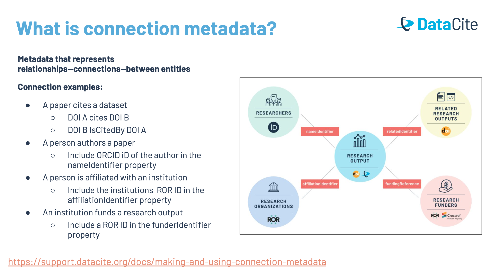
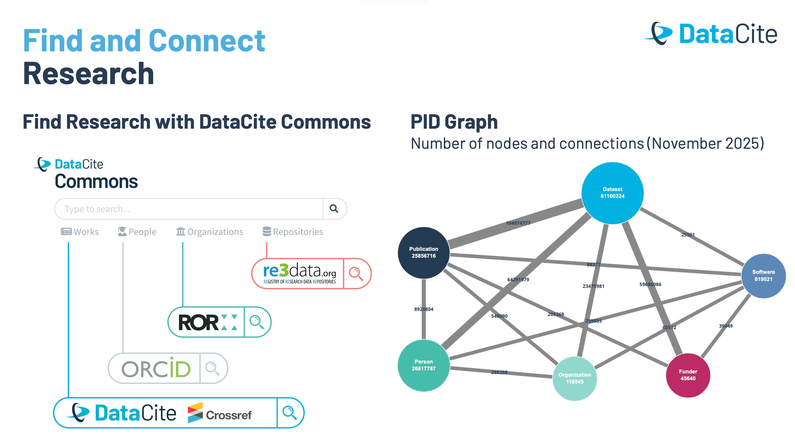

  
---
title: "Community Webinar: Connecting Research Software to the Scholarly Record with DataCite"
subtitle: "This blog post summarises the community webinar, featuring a conversation with Mohamad Mustafa, Community Specialist at *DataCite*, UAE."
date: 2026-04-14
authors:
  - "Jyoti Bhogal"
  - "Mohamad Mostafa"
  - "Saranjeet Kaur"
  
categories:
  - Research Software Engineering
  - Open Science
  - Open Data
  - Open Source Software
  - Research Infrastructure
  - Citation
  - PIDs
  - Asia
summary: "This blog post summarises the community webinar, featuring a conversation with Mohamad Mustafa, Community Specialist at *DataCite*, UAE. We discuss how DataCite’s open PID infrastructure and rich metadata support the persistent identification and discoverability of research software."
image:
  preview_only: true
  filename: "rse_asia_webinar_datacite_banner.png"
draft: false
---

*A recap of our RSE Asia webinar meetup*

In today’s research landscape, software is no longer a side-product \- it sits at the heart of how knowledge is generated, analysed, and shared. Yet, despite its importance, research software often remains difficult to cite, hard to discover, and poorly connected to the rest of the scholarly record.

In our recent RSE Asia webinar, *“[Connecting Research Software to the Scholarly Record with DataCite](https://rse-asia.github.io/RSE_Asia/event/2026-04-14_datacite_webinar/)”,* we explored how this gap can be addressed. Hosted by Jyoti Bhogal and co-led by Saranjeet, the session featured [Mohamad Mustafa](https://www.linkedin.com/in/mohamad-mostafa/), Community Specialist at [DataCite](https://datacite.org/), who shared both conceptual foundations and practical pathways for making research software more visible, citable, and connected.

## **Why Connecting Research Software Matters**

The session began with a question that resonated with many participants: how can researchers ensure that their software is properly credited and discoverable? While journal articles continue to dominate academic recognition, they represent only the final stage of a much longer research process. Behind every publication lies a series of outputs \- code, datasets, workflows, and presentations \- that are rarely given equal importance.

This imbalance creates a disconnect. Researchers invest significant time developing software, yet without proper infrastructure, that work often remains invisible. The webinar highlighted that solving this problem is not just about tools, but about changing how we think about research outputs altogether.

## **Open Science and the Role of Infrastructure**

To frame this discussion, Mohamad referred to the [2021 recommendations by UNESCO on Open Science](https://unesdoc.unesco.org/ark:/48223/pf0000379949). These recommendations emphasise that open science is not only about making outputs accessible, but also about building systems that allow those outputs to be identified, recognised, connected, and reused.

A key idea here is “unambiguous identification.” In a global research ecosystem, where thousands of outputs and contributors interact, clarity is essential. Persistent identifiers (PIDs) provide that clarity. Whether through [DOIs](https://support.datacite.org/docs/doi-basics) for outputs, [ORCID](https://orcid.org/) IDs for researchers, or [Research Organisation Registry (ROR)](https://ror.org/) IDs for institutions, these identifiers allow us to map relationships across the research landscape.

Rather than isolated pieces of work, research becomes a network of interconnected contributions.

## **Understanding DataCite’s Role**

At the centre of this infrastructure is DataCite, a global non-profit organisation established in 2009\. Initially focused on enabling citation for research data, DataCite has since evolved into a broader platform that supports a wide range of research outputs.

Today, its community includes over 1,700 organisations across more than 70 countries, collectively registering over 124 million DOIs. However, what makes DataCite particularly impactful is not just the scale of its operations but its philosophy. It is built around the idea that all research outputs \- whether datasets, software, or presentations \- should be treated as valuable contributions to knowledge.

This perspective is especially important for research software, which has historically been overlooked despite its critical role.

## **Software as a Recognised Research Output**

One of the most significant shifts discussed during the webinar was the growing recognition of software as a legitimate research output. DataCite formally introduced software as a resource type in 2017, enabling it to be assigned DOIs and described through metadata.

*Image: List of resource types that can me get a DOI via DataCite Fabrica, including ‘Software’*

Since then, the number of software records in the DataCite registry has steadily increased. This growth reflects a broader cultural change within the research community, where software is increasingly acknowledged as something that should be cited, shared, and preserved.

*Image: Increased reporting of software as a research output since 2017, when it was first made a research output type in DataCite Fabrica.*

The data also shows that this trend is accelerating. Even early into 2026, tens of thousands of software entries had already been registered, suggesting that researchers are beginning to see the value of making their code visible and citable.

## **The Role of Repositories**

An important part of this ecosystem is the role played by repositories. Platforms such as Zenodo, Figshare, and Code Ocean allow researchers to deposit their software and automatically receive DOIs.

*Image: Top 10 repositories that contribute Software outputs to DataCite Fabrica*

For many participants, this was a practical takeaway. Even if an institution is not directly connected to DataCite, researchers can still benefit from its infrastructure by using repositories that are already part of the DataCite community via DataCite Fabrica. In this way, access to persistent identifiers becomes more inclusive and widely available.

## **Metadata: The Foundation of Connection**

A recurring theme throughout the session was metadata. While often overlooked, metadata is what enables research outputs to be understood, discovered, and connected.

DataCite’s Metadata Schema provides a structured way to describe outputs. At a minimum, this includes essential information such as the creator, title, publication year, and resource type. However, the schema also allows for much richer descriptions, including subjects, contributors, funding details, and relationships to other outputs.

*Image: DataCite Metadata schema*

This flexibility is crucial. It means that researchers are not simply assigning identifiers, but also embedding their work within a broader context.

## **Building Connections Through Metadata**

The real power of DataCite becomes apparent when looking at how these metadata elements are used to create connections. Through specific fields, researchers can link their software to related outputs such as journal articles or datasets. They can also associate their work with their ORCID profile, ensuring that their contributions are accurately attributed.

At the same time, institutions can be linked through ROR identifiers, and funders can be acknowledged within the same framework. What emerges is a network where every element \- people, organisations, and outputs \- is connected.

This interconnected structure is often described as the PID Graph. It allows researchers to trace the full lifecycle of a research project, from funding and development to publication and reuse.

## **Why DOIs Make a Difference**

Assigning a DOI to research software has several important implications. First, it increases visibility. Outputs with DOIs are indexed and harvested by various discovery platforms, making them easier to find. Second, it enables citation, allowing software to be referenced in the same way as traditional publications.

There is also an institutional dimension. When a university is listed as the publisher of a DOI-registered output, its contributions become more visible within the global research ecosystem. Over time, this can strengthen the institution’s profile and demonstrate the breadth of its research activity, along with providing the recognition to the individual who created the outputs.

Perhaps most importantly, DOIs support a more holistic understanding of research. Instead of focusing solely on final publications, they allow all outputs \- software included \- to be recognised and valued.

## **Exploring Data Through DataCite Commons**

To make these connections visible, DataCite provides an open platform called DataCite Commons.

*Image: PID graph*

Through DataCite Commons, users can explore millions of DOI records, view relationships between outputs, and track contributions across individuals and organisations. The platform integrates with ORCID and ROR, further enhancing its ability to present a connected view of the research landscape.

An important point highlighted during the session is that metadata in Commons is always openly accessible. Even if the underlying resource is restricted, its descriptive information remains available, ensuring transparency and discoverability.

## **From Theory to Practice**

One of the most engaging parts of the webinar was a live demonstration of how these concepts work in practice. Mohamad showed how a presentation could be uploaded to Zenodo, assigned a DOI, and linked to both an ORCID profile and an institutional ROR ID.

This simple workflow illustrated how easily research outputs can be integrated into the scholarly record when the right infrastructure is in place. It also highlighted the long-term benefits, such as the ability to track impact and maintain a consistent record of contributions, even when researchers move between institutions.

## **Reflections from the Q\&A**

The discussion that followed reinforced many of these ideas. Participants were particularly interested in how individuals could engage with DataCite without institutional membership. The answer was encouraging: by using repositories like Zenodo, researchers can still obtain DOIs and benefit from the broader ecosystem.

There was also interest in linking software hosted on platforms like GitHub. As explained, this is entirely possible through metadata fields that allow URLs to be included, further strengthening connections between different parts of a project.

Another important clarification was around access. While DataCite makes metadata freely available, access to the full content depends on the policies of the hosting repository. This distinction ensures openness while respecting different access models.

## **Looking Ahead**

As the session concluded, it became clear that the tools and infrastructure needed to support research software already exist. What remains is wider adoption and cultural change.

For RSE Asia, this conversation is part of a broader effort to understand and strengthen the research software ecosystem. The ongoing community survey, upcoming events, and shared resources all contribute to this goal.

## **Final Thoughts**

The webinar highlighted a simple but powerful idea: research software deserves to be treated as a first-class research output. By adopting persistent identifiers, using rich metadata, and engaging with open infrastructure, researchers can ensure that their work is not only visible but also properly recognised and connected.

In doing so, we move towards a more complete and inclusive scholarly record \- one that reflects the full complexity of modern research.

## **What’s next?**

Meanwhile, RSE Asia encourages community members to:

- Participate in the ongoing [research software landscape survey in Asia](https://docs.google.com/forms/d/e/1FAIpQLSeLWbwy2vL67b-Qxjf3VRsRvYFBfH0_r7Zs4YhkX4A3I_0L3w/viewform), which is open until 31 May 2026\. You also stand a chance to win a cash prize of £10 for 5 participants based on a raffle.  
- For the 3rd episode of the community conversation series [Research Software and NRENs in Asia](https://rse-asia.github.io/RSE_Asia/event/) on 12 May 2026, register for [Episode 3: Role of Libraries in Research Support for Scientific Software](https://rse-asia.github.io/RSE_Asia/event/2026-05-12_ep-3-library/), where we welcome [Victoria F. Caplan](https://www.linkedin.com/in/victoria-f-caplan-62a48b8/), Head of Research & Learning Support, Hong Kong University of Science and Technology (HKUST), Hong Kong, with whom we will discuss the role of the library infrastructure in supporting the research software communities.  
- Join the RSE Asia [Community Membership](https://docs.google.com/forms/d/e/1FAIpQLSci4FOE7wBeDJQowDSmweujLhJFfzr2rut46yKJc0agkE7Jug/viewform?usp=header) to get the latest news.  
- Follow [RSE Asia](https://www.linkedin.com/company/rse-asia-association/) on LinkedIn for updates and opportunities

## **Resources:**

If you were not able to join the meetup live or would like to revisit it, the
***video recording*** of the episode is coming soon. Throughout the meetup, the
guest, the facilitators, and the participants shared a bunch of useful
resources for the community for shared progress. We have compiled it in the
form of a Resource Sheet. Definitely, check it out\!  

**Resource sheet:** Zenodo link coming soon\!

------------------------------------------------------------------------

### **Learn more about us**

If you have any questions about, please reach out to us at:
rse.asia.association@gmail.com.
For more information and to join upcoming events, visit:

- Website: <https://rse-asia.github.io/RSE_Asia/>
- For the latest news, events, activities, and opportunities, follow us on our
[LinkedIn page](https://www.linkedin.com/company/rse-asia-association/)
- To join the RSE Asia community, please fill out our short
[Community Membership Form](https://docs.google.com/forms/d/e/1FAIpQLSci4FOE7wBeDJQowDSmweujLhJFfzr2rut46yKJc0agkE7Jug/viewform?usp=header)
