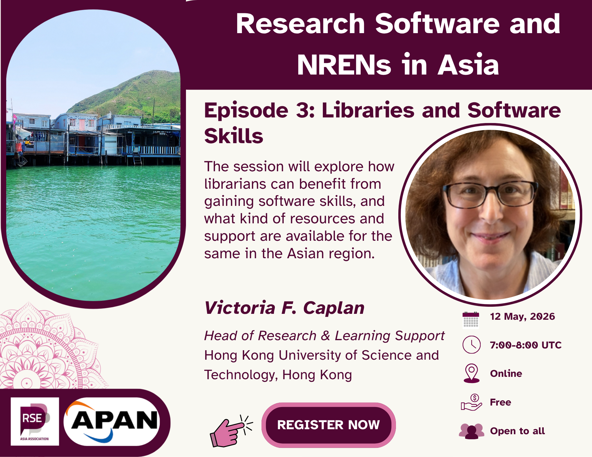

  
---
title: "Episode 3: Role of Libraries in Research Support for Scientific Software"
subtitle: "This blog post summarises the third episode of the Research Software and NRENs in Asia series, featuring a conversation about the role of libraries in research support for scientific software across the research lifecycle, with Victoria F Caplan, Head of Research and Learning Support, Hong Kong University of Science and Technology (HKUST)."
date: 2026-05-28
authors:
  - "Jyoti Bhogal"
  - "Victoria F Caplan"
  - "Saranjeet Kaur"
  
categories:
  - Research Software Engineering
  - Community Building
  - Library and Information Science
  - Asia
summary: "This blog post summarises the third episode of the Research Software
and NRENs in Asia series, featuring a conversation about the role of libraries in research support for scientific software across the research lifecycle, with Victoria F Caplan, Head of Research and Learning Support, Hong Kong University of Science and Technology (HKUST)."
image:
  preview_only: true
  filename: "rs_nren_series_banner_episode_3.png"
draft: false
---

On 12 May 2026, the 
[RSE Asia Association](https://rse-asia.github.io/RSE_Asia/) hosted the third
episode of its ongoing Community Call series,
[*Research Software and NRENs in Asia*](https://rse-asia.github.io/RSE_Asia/event/), featuring an insightful conversation with [**Victoria F. Caplan**](https://www.linkedin.com/in/victoria-f-caplan-62a48b8/), the
[*Head of Research and Learning Support*](https://library.hkust.edu.hk/) at the
[Hong Kong University of Science and Technology](https://www.linkedin.com/school/hkust/posts/?feedView=all). The session explored how software, technical skills, and
digital scholarship are reshaping the role of modern libraries and the
professionals who work within them.

The series itself is part of the Memorandum of Understanding between the
[RSE Asia Association](https://rse-asia.github.io/RSE_Asia/) and the
[Asia Pacific Advanced Network](https://apan.net/), focusing on conversations
around research software, infrastructure, open science, and collaboration
across Asia. Previous episodes covered topics such as the role of the NRENs in
the research software ecosystem, research software and environmental research,
open science, open data, and open source software practices. This episode
shifted attention toward libraries as evolving digital and research support
spaces.

The discussion highlighted an important reality: libraries are no longer only repositories of books and journals. Increasingly, they are becoming hubs for
digital scholarship, metadata management, open science, research analytics,
technical training, and even software-enabled experimentation.

## **A Career That Mirrors the Evolution of Libraries**

Victoria Caplan opened the session by reflecting on her 33-year journey at
[HKUST Library](https://library.hkust.edu.hk/). Beginning in cataloguing and
metadata work, she later moved into user services, access services, and
eventually research and learning support. Along the way, she witnessed the
evolution of library formats from microfiche, CDs, DVDs, and laserdiscs to
digital repositories, online scholarly communication, and research data
management.

Her career trajectory itself reflected the transformation of libraries over the
past few decades. Libraries today are expected not only to help users discover information but also to support researchers in managing their outputs,
preserving digital content, navigating open access requirements, and
understanding the broader research ecosystem.

Victoria also spoke about how completing her own MPhil later in her career
helped her better empathise with postgraduate researchers. Having personally experienced the research process gave her deeper insight into the kinds of
support students and scholars truly need.

## **The Moment Software Became Central to Libraries**

One of the most memorable reflections from the session came when Victoria
described the moment she realised software and networks would fundamentally
transform research support. She traced this back nearly 40 years to 1986, when
an archivist at her university used an early networked system to locate
archival materials for her undergraduate thesis in another city. Before that experience, access to information had been limited to local card catalogues
and physical indices.

That moment revealed the power of networked information systems: the idea that knowledge could be discovered and connected beyond the physical boundaries of
one library. Long before the modern web existed, the foundations of digital scholarship and networked research infrastructure were already emerging.

One of Victoria’s reflections captured the transformational nature of
networked research infrastructure:

{}
> “I realised that there were all sorts of things that were available online that could be looked up on computers and that were networked together so that I was no longer stuck with what the contents of our card catalogue contained.”

— Victoria F. Caplan
{}

Although she was describing an experience from the 1980s, the observation
still resonates today. Research support increasingly depends on connected
systems, interoperable platforms, and digital access that extends far beyond
the walls of a single institution.

## **The Expanding Technical Skillset of Library Professionals**

As the discussion progressed, Victoria outlined the growing range of software
and technical skills now expected within libraries. Her answer painted a
picture of librarianship that is increasingly intertwined with data, software
systems, analytics, and digital infrastructure.

Among the key areas she highlighted were metadata and data management, data
cleaning and quality assurance, bibliometrics and research analytics,
reference management tools such as [BibTeX](https://www.bibtex.org/),
[Zotero](https://www.zotero.org/), and [EndNote](https://endnote.com/),
Integrated Library Systems (ILS), cybersecurity and privacy awareness,
intellectual property and digital rights management, research databases and
discovery systems, AI-assisted literature review tools, and interactive
teaching and workshop design.

A recurring theme throughout the conversation was that technical skills are
meaningful only when tied to a practical purpose. Libraries are not adopting
software for its own sake. Rather, these tools are increasingly essential for
helping researchers discover, organise, preserve, analyse, and disseminate
knowledge effectively.

Victoria also emphasised the ethical responsibilities that come with digital infrastructure. Libraries often sit between users and large commercial
platforms that collect significant amounts of data. As a result, librarians
must think carefully about privacy, intellectual property, and responsible
stewardship of information.

## **Learning Through Curiosity, Community, and Experimentation**

One of the strongest messages from the session was the importance of creating environments where staff can explore, experiment, and learn continuously.

Rather than enforcing rigid top-down skill development programmes, Victoria
advocated for fostering curiosity. People should be encouraged to explore areas
they genuinely care about and then discover how those interests can connect
back to organisational needs.

At the HKUST Library, this culture of learning takes many forms:

- Staff are encouraged to attend webinars, conferences, and university
training programmes.  
- Participating in professional development activities is not just a good-to-do
thing; instead, it is an expectation.  
- Colleagues share learning notes after professional development activities.  
- Internal “LibConnect” sessions allow staff to present ideas and experiences
to others in an informal setting with snacks and tea.  
- An AI interest group, created in 2023, helps staff collectively explore
emerging technologies.  
- Staff are supported in applying new skills through practical projects.

Victoria shared a particularly creative example involving an internal
Mid-Autumn Festival AI image-generation challenge. In fall 2023, Staff
experimented with free AI image tools to create festival-themed visuals, which
were later used on library communications platforms. The activity was
intentionally playful and low-pressure, helping reduce intimidation around new technologies while encouraging hands-on exploration.

Victoria repeatedly returned to the importance of creating environments where curiosity is encouraged rather than restricted:

{}
> “If you don't allow people to be curious and explore things, then they can
never develop.”

— Victoria F. Caplan
{}

This idea became one of the central themes of the discussion. Technical
growth, according to Victoria, does not happen through rigid mandates alone.
It emerges when people are given space to experiment, ask questions, and
connect their interests to meaningful work.

## **From Learning to Application**

Throughout the webinar, Victoria stressed that certifications alone are not
enough. Technical knowledge must be translated into practice. One of the
mistakes she warned against was accumulating badges and credentials without
finding ways to integrate those skills into everyday work.

To encourage practical application, the
[HKUST Library](https://library.hkust.edu.hk/) supports small internal
projects where staff can experiment with coding, analytics, and digital tools.

Examples included:

- An [open-access journal finder](https://library.hkust.edu.hk/research-learning-support/research-support/publishing-sharing-your-research/open-access-publishing) that helps researchers identify journals covered by institutional publishing agreements.
- Interactive [Library data analytics](https://library.hkust.edu.hk/about-us/statistics/library-data-analytics-dashboards) dashboards.
- Digital humanities [online tutorials](https://digitalhumanities.hkust.edu.hk/tutorials/).
- A [temperature heat map](https://lbapps.hkust.edu.hk/heatmap/index.html)
project created with
[sensors and student collaboration](https://library.hkust.edu.hk/news-events/news/heatmap-on-floorplan) in 2024 to help users find warmer or cooler study spaces
in the library.

Another memorable insight from the session focused on the relationship between
theory and practice:

*“There’s praxis, the unity of theory and action.”*

Victoria emphasised that technical learning becomes valuable only when people
are able to apply it in practical contexts. Certifications and training courses
are useful, but their real impact comes when they help solve problems, improve workflows, or support users more effectively.

## **Managing Constraints in Real Institutions**

The conversation also addressed a more difficult challenge: balancing
innovation with limited time, staffing, and resources.

Victoria spoke candidly about the realities of management. Supporting
professional development often means making difficult choices about priorities.
If staff spend time learning new tools or technologies, then some older
workflows or lower-priority activities may need to be reduced or retired.

She described how libraries must continually evaluate what still provides value
and what persists simply because *“**it has always been done that way**.”*

One example involved metadata practices. Decades ago, librarians spent
extensive time manually refining and perfecting metadata records. Today, much
metadata arrives directly from publishers, often imperfectly. While clean
metadata still matters, libraries must balance perfectionism against newer
priorities and user expectations. Victoria humorously described the shift as
moving from *“Savile Row bespoke suit metadata”* to *“fast fashion”*, an
insight from her University Librarian, Dr Gabi Wong.

While discussing organisational change, Victoria used an old piece of writing
advice, applied to organisational change. that resonated strongly with the
audience:

{}
> “Sometimes when they’re editing, writers say you have to ‘[kill your darlings](https://slate.com/culture/2013/10/kill-your-darlings-writing-advice-what-writer-really-said-to-murder-your-babies.html).’”

— Victoria F. Caplan
{}

In the context of libraries, this referred to the difficult but necessary
process of letting go of workflows or practices that may once have been
valuable but no longer serve users effectively. Making space for innovation
often requires making difficult choices about priorities.

## **Future-Proofing Is Impossible \- But Adaptability Matters**

Toward the end of the session, Victoria was asked what advice would she give
to future librarians and early-career professionals hoping to “future-proof”
their careers.

Victoria’s response was refreshingly honest:

{}
> “The truth is there’s no such thing as future-proofing.”

— Victoria F. Caplan
{}

Rather than chasing certainty, she encouraged participants to cultivate
adaptability, curiosity, and resilience. Technologies will continue changing,
but the ability to learn and evolve remains far more durable than mastery of
any single tool.

She encouraged participants to explore widely, develop both technical and
social skills, build expertise in areas they genuinely care about, stay open
to changing technologies and workflows, and focus on the enduring questions
behind the tools.

One particularly memorable observation was that while technologies change,
many of the underlying questions remain the same. Libraries will always need
to think about:

- how knowledge is organised,  
- how access is preserved,  
- how privacy is protected,  
- how information is transmitted ethically,  
- and how people connect with trustworthy information.

Victoria also shared a quote from a science fiction novel that she felt
captured the relationship between technology and professional practice:

{}
> “The questions remain the same, but the answers change.”

-- Victoria F. Caplan, quoting from a science fiction novel
{}

She used this idea to explain how libraries continue to face enduring
challenges around access, preservation, discovery, and ethics \- even as the technologies used to address those challenges evolve dramatically over time.

Victoria also referenced S. R. Ranganathan and his famous Fifth Law of Library
Science:

{}
> “The library is a growing organism.”

-- Victoria F. Caplan, referencing S. R. Ranganathan
{}

That quote captured the spirit of the entire conversation. Libraries are not
static institutions. They continuously evolve alongside technology, research
culture, and society itself.

## **Libraries as Connectors in the Research Ecosystem**

During the audience Q\&A, participants discussed integrated library systems, institutional repositories, and the organisational structure of research
support services at the HKUST. Victoria explained that the HKUST Library
maintains a strong systems team and has historically invested heavily in
digital infrastructure and remote access services.

An especially interesting discussion emerged around institutional differences.
A participant from the University of Melbourne noted that many similar services
at their institution exist outside the library.

Victoria reflected that organisational boundaries often emerge from
institutional history rather than strict rules about where activities “should”
belong. What matters most is not necessarily which department owns a service,
but whether the institution successfully supports researchers, preserves
knowledge, and enables access.

## **Final Reflections**

This episode highlighted that libraries are deeply connected to the future of
research software, digital scholarship, and open science. Far from being
passive support units, modern libraries are increasingly active collaborators
in research ecosystems.

They are places where metadata meets ethics, where technical infrastructure
meets teaching, and where curiosity drives continuous learning.

Toward the end of the conversation, Victoria summarised one of the most
important lessons for professional growth:

{}
> “Share your conclusions.”

-- Victoria F. Caplan
{}

The comment reflected the broader spirit of the session itself: learning
becomes more meaningful when knowledge, experiences, and experimentation are
shared openly across communities.

Perhaps the most important takeaway from the conversation was that technical transformation in libraries is not only about software adoption. It is equally
about people: creating cultures that encourage experimentation, sharing,
mentorship, and curiosity.

As research ecosystems across Asia continue evolving, these conversations
between librarians, research software engineers, digital scholarship
practitioners, and research communities will only become more important.

## **What’s next?**

Meanwhile, RSE Asia encourages community members to:

- Participate in the ongoing
[research software landscape survey in Asia](https://docs.google.com/forms/d/e/1FAIpQLSeLWbwy2vL67b-Qxjf3VRsRvYFBfH0_r7Zs4YhkX4A3I_0L3w/viewform), which is
open until 30 June 2026\. You also stand a chance to win a cash prize of £10
for 5 participants based on a raffle.  
- For the 4th episode of the community conversation series
[Research Software and NRENs in Asia](https://rse-asia.github.io/RSE_Asia/event/), on 15 July 2026, register for
[Episode 4: Open Science, Research Infrastructure, and Collaboration](https://us06web.zoom.us/meeting/register/dml6G_dFQ7SEm17uXVU3CQ#/registration),
where we welcome [Su Nee Goh](https://www.linkedin.com/in/su-nee-goh-0132232/),
Deputy Director, [Nanyang Technological University (NTU)](https://www.linkedin.com/school/ntusg/),
Singapore, with whom we will discuss open science, research infrastructure,
and collaboration across the Asian research ecosystem.  
- Join the RSE Asia [Community Membership](https://docs.google.com/forms/d/e/1FAIpQLSci4FOE7wBeDJQowDSmweujLhJFfzr2rut46yKJc0agkE7Jug/viewform?usp=header)
to get the latest news.  
- Follow [RSE Asia](https://www.linkedin.com/company/rse-asia-association/) on LinkedIn for updates and opportunities.

## **Resources:**

If you were not able to join the meetup live or would like to revisit it, the [***video recording***](https://youtu.be/MbvTgTJMTtg%20) of the episode is available.

<iframe width="560" height="315" src="https://www.youtube.com/embed/MbvTgTJMTtg?si=ns-PHssZZHRPKK0e" title="YouTube video player" frameborder="0" allow="accelerometer; autoplay; clipboard-write; encrypted-media; gyroscope; picture-in-picture; web-share" referrerpolicy="strict-origin-when-cross-origin" allowfullscreen></iframe>

Throughout the meetup, the guest, the facilitators, and the participants shared a bunch of useful resources for the community for shared progress. We have compiled it in the form of a Resource Sheet. Definitely, check it out\!

***Resource sheet:*** Coming soon!
------------------------------------------------------------------------

### **Learn more about us**

If you have any questions about, please reach out to us at:
rse.asia.association@gmail.com.
For more information and to join upcoming events, visit:

- Website: <https://rse-asia.github.io/RSE_Asia/>
- For the latest news, events, activities, and opportunities, follow us on our [LinkedIn page](https://www.linkedin.com/company/rse-asia-association/)
- To join the RSE Asia community, please fill out our short [Community Membership Form](https://docs.google.com/forms/d/e/1FAIpQLSci4FOE7wBeDJQowDSmweujLhJFfzr2rut46yKJc0agkE7Jug/viewform?usp=header)
