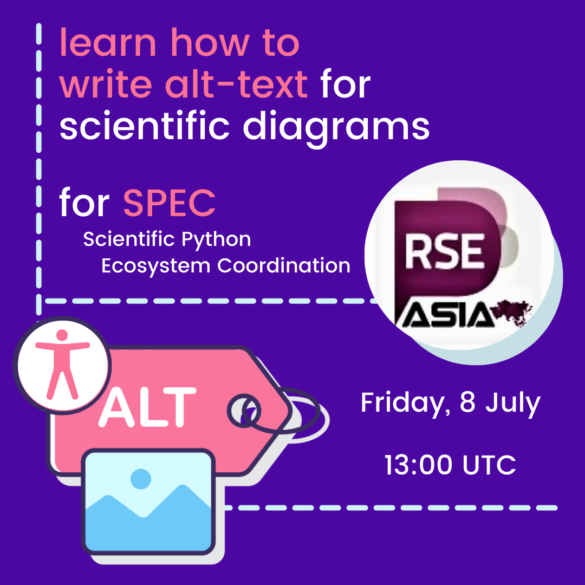

_Image: Alt-text Workshop._

# Workshop hosts:

- Mars Lee is a technical illustrator who contributes to data science software and open-source Python projects such as NumPy. She grew up in Singapore and rollerskates. 🛼
- Isabela Presedo-Floyd (she/her) is a UX/UI designer in theory and professional question-asker in practice. She helps build open-source scientific software with an emphasis on improving the accessibility of communities and their tools.

When: Friday, 8th July 2022, 13:00 UTC

Where: Online

### **Learn More About Us**

For more information and to join upcoming events, visit:

#### RSE Asia

- Website: <https://rse-asia.github.io/RSE_Asia/>
- For the latest news, events, activities, and opportunities, follow us on our [LinkedIn page](https://www.linkedin.com/company/rse-asia-association/)
- To join the RSE Asia community, please fill out our short [Community Membership Form](https://docs.google.com/forms/d/1XSxDaTJzcNyGeDYXyJNVg1TDCo7un18PLFNiK6_jL2g/edit)
