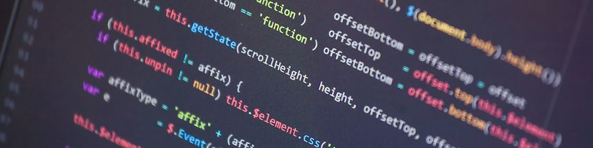

_"A computer screen with a bunch of code" image is licensed as free to use under the [Unsplash License](https://unsplash.com/license)._

In the last episode of the series on 'Enabling Open Science through Research Code', we will explore opportunities related to funding for research software-related work. 

**20 March 2025 @ 8:30 - 10:00 am UTC [(see in your local time)](https://www.timeanddate.com/worldclock/fixedtime.html?msg=Research+Software+Funding&iso=20250320T0830&p1=1440&ah=1&am=30)**

**[Register now](https://us06web.zoom.us/meeting/register/tZwodO2pqD0rGtUTKdPjxP2j2X1gFioPn2bo#/registration)**

## Our Speakers

- **[Carlos Martinez-Ortiz](https://bsky.app/profile/neocarlitos.bsky.social)**,
  Scientific Community Manager, _Netherlands eScience Center_
  
  Carlos is a Community Manager at the [Netherlands eScience Center](https://www.esciencecenter.nl/). His work focuses on topics related to software sustainability at the eScience Center, advancing its goal to empower researchers by collaboratively designing sustainable software, and building digital skills and expertise.

- **[Colette Bos](https://www.linkedin.com/in/colettebos/)**,
  Programme Director _Netherlands eScience Center_
  
  Colette holds a PhD in research policy/research sociology and has extensive experience in research policy, research funding, impact of science evaluations and open science. She has worked at the [Netherlands eScience Center](https://www.esciencecenter.nl/) for two years as Programme Director where she is responsible for the project portfolio of the center.
  
- **[Gemma Turon Rodrigo](https://www.linkedin.com/in/gemma-turon/)**, Executive Director, _Ersilia Open Source Initiative_
  
  Trained as a molecular biologist, Gemma completed a PhD in colorectal cancer and stem cells at IRB Barcelona in 2019, before taking a one-year break to focus on working and volunteering in the third sector. This shifted her scientific interest to global health and neglected diseases, and the existing barriers to tackle some of the most urgent health issues in developing countries. With [Ersilia](https://www.ersilia.io/), she aims to explore new ways of community building and engagement in the scientific arena, at the intersection between academia, biotech start-ups and NPOs.
  
- **[John Chevers](https://www.linkedin.com/in/gemma-turon/)**, Technology Lead, _Data for Science and Health, Wellcome Trust_
  
  John Chevers is Technology Lead in the [Data for Science and Health Team](https://wellcome.org/who-we-are/teams/data-science-and-health-team) at the Wellcome Trust. He has held leadership roles in industry, the NHS and academia, and has a particular interest in the funding and sustainability of software and data resources. Prior to working in the health sector, John led partnerships and commercial strategy for GEANT, the pan-European internet for research and education. He holds a PhD in Physics and an MSc in electrical engineering. 
  
- **[Joseph Wafula](https://www.linkedin.com/in/joseph-wafula-768a2371/)**, Professor and Lead, _African Open Science Platform East Africa Node_

### **Learn More About Us**

For more information and to join upcoming events, visit:

- Website: <https://rse-asia.github.io/RSE_Asia/>
- For the latest news, events, activities, and opportunities, follow us on our [LinkedIn page](https://www.linkedin.com/company/rse-asia-association/)
- To join the RSE Asia community, please fill out our short [Community Membership Form](https://docs.google.com/forms/d/1XSxDaTJzcNyGeDYXyJNVg1TDCo7un18PLFNiK6_jL2g/edit)
