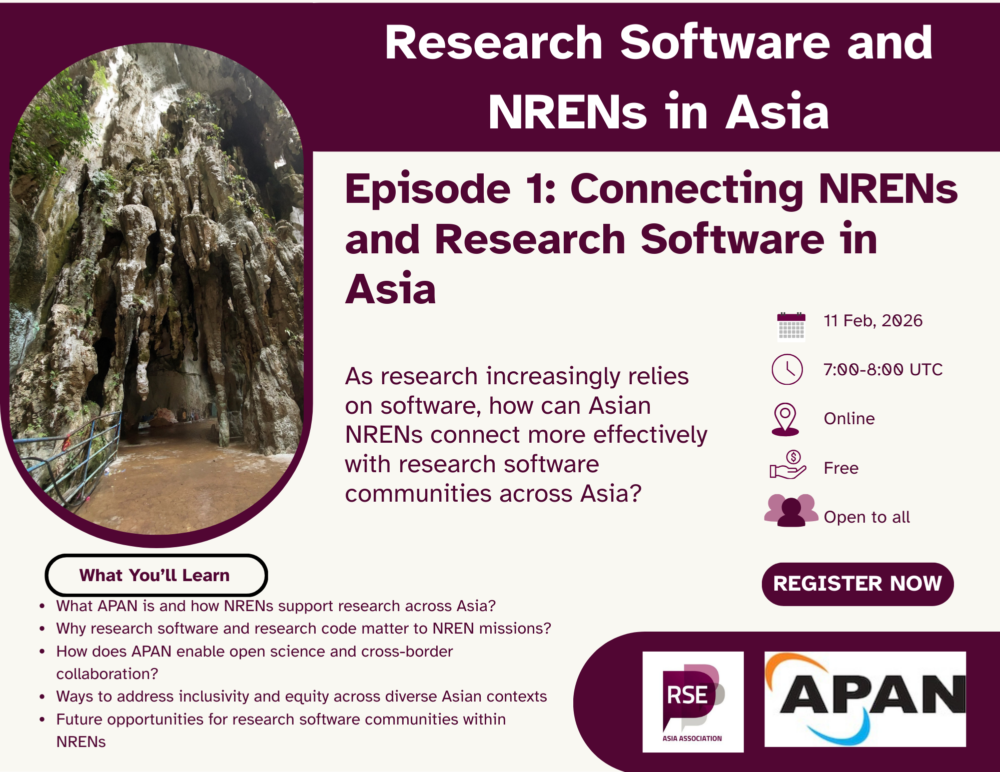

In the first episode of the series 'Research Software and NRENs in Asia', we will explore the role of National Research and Education Networks (NRENs) in supporting research software development and sustainability in the Asian region. 

**11 February 2026 @ 7:00 - 8:00 UTC [(see in your local time)]()**

**[Register now]()**

## Invited Guest

- **[Liana Jacinta](https://www.linkedin.com/in/lianajacinta/)**,
  General Manager, _Asia Pacific Advanced Network (APAN)_, Malaysia
  
  Liana Jacinta is a senior executive specialising in industry–academic 
  partnerships, large-scale conference delivery, and international stakeholder 
  engagement. She provides operational leadership at Global Support Services, 
  where her team developed ORBIT, a customisable event and engagement platform 
  supporting high-impact conferences and complex, multi-stakeholder programmes.
     
  As General Manager of the Asia Pacific Advanced Network (APAN), Liana leads 
  initiatives that enhance organisational visibility, expand memberships and 
  strategic partnerships, and deliver sustainable revenue growth. She provides 
  operational oversight across finance, administration, human resources, and 
  IT, ensuring efficient, agile, and commercially sound service delivery.
     
  With a strong focus on execution, collaboration, and value creation, Liana 
  actively champions working groups and cross-sector partnerships that 
  translate innovation and research into real-world outcomes.

### **Learn More About Us**

For more information and to join upcoming events, visit:

- Website: <https://rse-asia.github.io/RSE_Asia/>
- For the latest news, events, activities, and opportunities, follow us on our [LinkedIn page](https://www.linkedin.com/company/rse-asia-association/)
- To join the RSE Asia community, please fill out our short [Community Membership Form](https://docs.google.com/forms/d/1XSxDaTJzcNyGeDYXyJNVg1TDCo7un18PLFNiK6_jL2g/edit)
