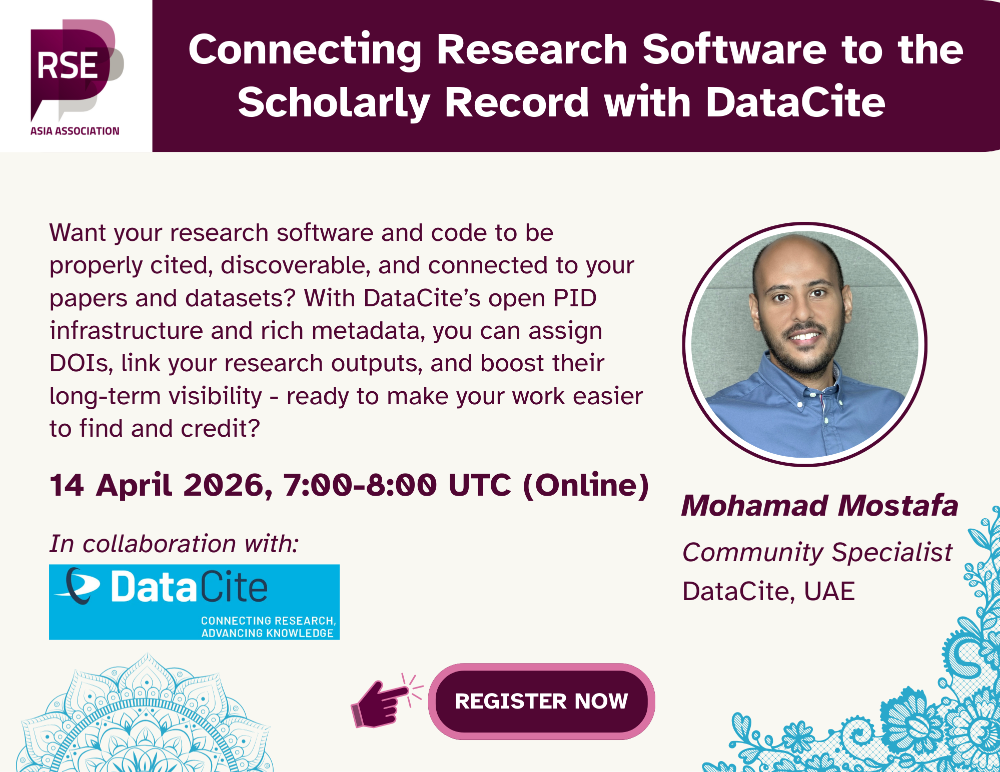

In this webinar, we will explore how DataCite's open PID infrastructure and
rich metadata support the persistent identification and discoverability of
research software. We will discuss practical use cases and demonstrate how
these capabilities enhance research visibility and contribute to a more
connected research infrastructure.

**14 April 2026 @ 7:00 - 8:00 UTC [(see in your local time)]()**

**[Register now](https://us06web.zoom.us/meeting/register/k8PBfge5QwKsg4jnbeXj1Q#/registration)**

## Invited Guest

- **[Mohamad Mostafa](https://www.linkedin.com/in/mohamad-mostafa/)**,
  Community Specialist, _DataCite_, UAE
  
  Mohamad supports institutions and communities around the world in adopting
  open research practices and values through DataCite membership, services,
  and activities. He is also a member of the UNESCO Working Group on Open
  Science Infrastructures.

### **Learn More About Us**

For more information and to join upcoming events, visit:

- Website: <https://rse-asia.github.io/RSE_Asia/>
- For the latest news, events, activities, and opportunities, follow us on our [LinkedIn page](https://www.linkedin.com/company/rse-asia-association/)
- To join the RSE Asia community, please fill out our short [Community Membership Form](https://docs.google.com/forms/d/1XSxDaTJzcNyGeDYXyJNVg1TDCo7un18PLFNiK6_jL2g/edit)
