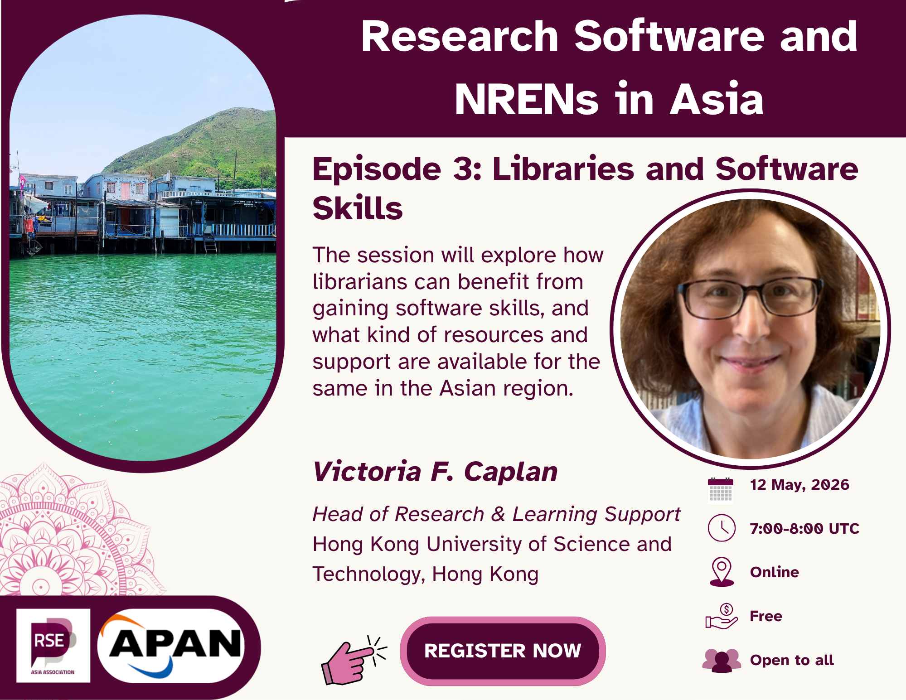

In the third episode of the series **‘Research Software and NRENs in Asia’**, we will focus on the changing role of libraries and information professionals in supporting research in software-intensive environments. Through an informal fireside chat, we will discuss how software and technical skills are becoming central to research support, how libraries are adapting to these changes, and how professionals can build confidence, capacity, and sustainable career pathways in this evolving landscape.

The session will explore themes such as skills development, mentorship, experimentation, leadership, and lifelong learning, with particular relevance to library staff supporting research and teaching across institutions in Asia.

**12 May 2026 @ 7:00 – 8:00 UTC [(see in your local time)]()**

**[Register now]()**

## Invited Guest

- **[Victoria Caplan](https://www.linkedin.com/in/victoria-f-caplan-62a48b8)**,
  Head of Research & Learning Support, _Hong Kong University of Science and Technology (HKUST)_, Hong Kong

  Victoria is an experienced research and library professional whose work focuses on supporting researchers and educators in environments increasingly shaped by software, data, and digital tools. She has extensive experience in building capacity, mentoring professionals, and fostering confidence in technical and software-related skills within library and research support communities. Her work emphasises professional development, leadership, and sustainable career pathways for information professionals navigating the changing research landscape.

### **Learn More About Us**

For more information and to join upcoming events, visit:

- Website: <https://rse-asia.github.io/RSE_Asia/>
- For the latest news, events, activities, and opportunities, follow us on our [LinkedIn page](https://www.linkedin.com/company/rse-asia-association/)
- To join the RSE Asia community, please fill out our short [Community Membership Form](https://docs.google.com/forms/d/1XSxDaTJzcNyGeDYXyJNVg1TDCo7un18PLFNiK6_jL2g/edit)
