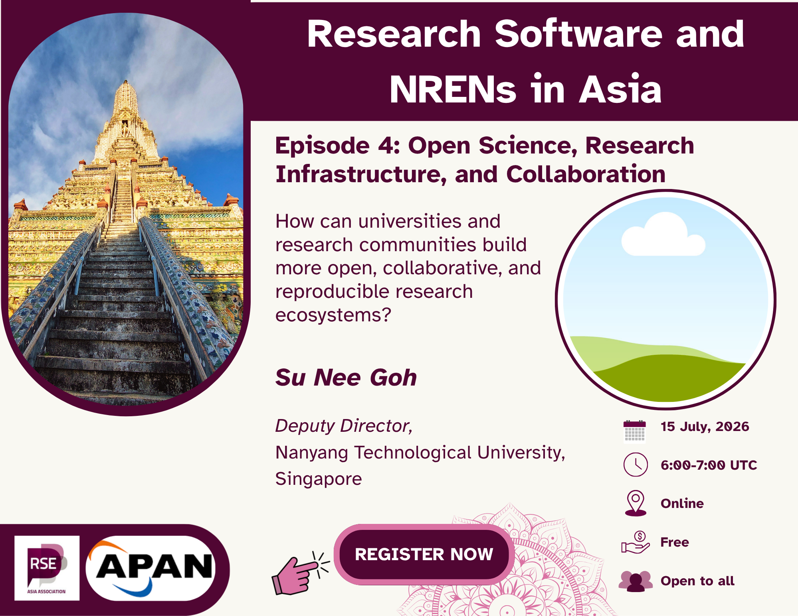

In the fourth episode of the **'Research Software and the NRENs'** in Asia
meetup series, we will be joined by Su Nee GOH for a conversation on open
science, research infrastructure, and collaboration across the Asian research
ecosystem. Drawing from her experience in information science, research
support, and international open science initiatives, the discussion will
explore the evolving relationship between research data, research software,
and institutional support structures.

We will also discuss the role of international communities, regional
collaborations, and the NRENs in enabling more open and collaborative
research practices in Asia. The session will further examine leadership,
policy, and long-term cultural change required to strengthen open scholarship
and reproducible research.

This meetup is conversational in format and intended for researchers, 
research software engineers, librarians, infrastructure providers, and
members of the broader open science community interested in the future of
research support.

**15 July 2026 @ 6:00 – 7:00 UTC [(see in your local time)](
https://www.timeanddate.com/worldclock/fixedtime.html?msg=Episode+4%3A+Open+Science%2C+Research+Infrastructure%2C+and+Collaboration&iso=20260715T06&p1=%3A&ah=1)**

<a class="rse rse-join" href="https://us06web.zoom.us/meeting/register/dml6G_dFQ7SEm17uXVU3CQ"> _**Register now!**_</a>

## Invited Guest

- **[Su Nee GOH](https://libguides.ntu.edu.sg/Profile/GohSuNee)**,
  Deputy Director, _[Nanyang Technological University (NTU)](https://www.ntu.edu.sg/)_, Singapore

  [Su Nee GOH](https://libguides.ntu.edu.sg/Profile/GohSuNee), is the Deputy Director and Lead, Open Science and Research Services, Library, [Nanyang Technological University (NTU)](https://www.ntu.edu.sg/). She leads a team that delivers guidance and
  services while fostering partnerships across areas such as open science, research data management planning, bibliometrics, research visibility and impact, and open access publishing. She has a Master of Science in
  Information Studies from NTU. She is a member of the International
  Association of Universities (IAU) [Expert Group on Open Science](https://iau.global/eg-on-open-science), a co-chair of the [Libraries for Research Data Interest Group](https://www.rd-alliance.org/groups/libraries-research-data/plenary-participation/) of the Research Data Alliance (RDA), and a member of the Steering Committee for the [Singapore Open Research Conference](https://libguides.ntu.edu.sg/SGORconference2026/home) and [Awards](https://libguides.ntu.edu.sg/SGORawards2026). She won the [ARMS-SG Leadership Award](https://www.researchmanagement.org.au/regional-interest-group/singapore) in 2025 and the [Library Association of Singapore Passion Award](https://las.org.sg/congratulations-to-2019-las-apbslg-sg-passion-award-goh-su-nee/) in 2020.

{}
### **Learn More About Us**

For more information and to join upcoming events, visit:

- Website: <https://rse-asia.github.io/RSE_Asia/>
- For the latest news, events, activities, and opportunities, follow us on our [LinkedIn page](https://www.linkedin.com/company/rse-asia-association/)
- To join the RSE Asia community, please fill out our short
[Community Membership Form](https://docs.google.com/forms/d/1XSxDaTJzcNyGeDYXyJNVg1TDCo7un18PLFNiK6_jL2g/edit)
{}
