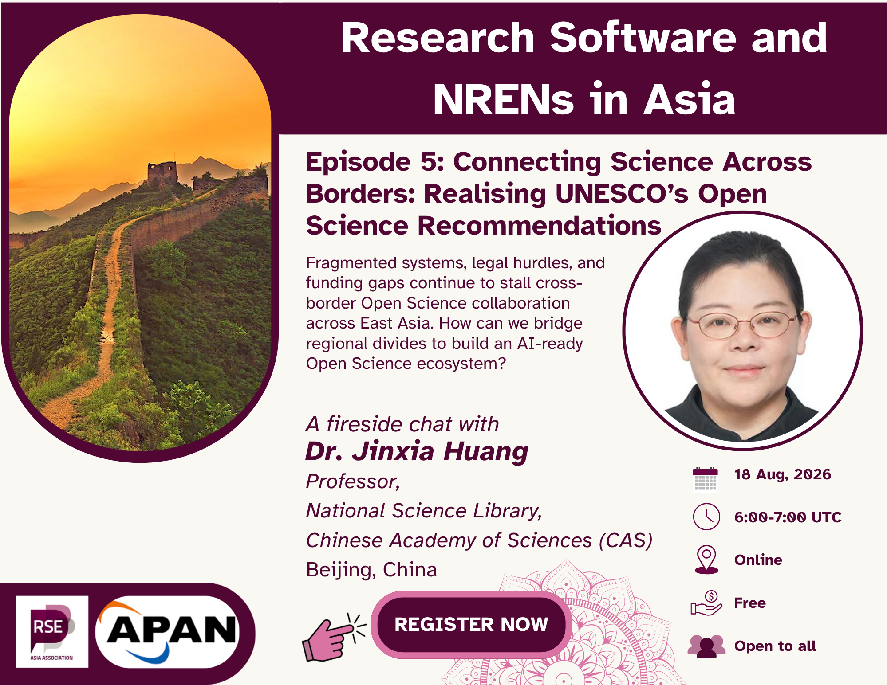

In the fifth episode of the **'Research Software and the NRENs'** in Asia meetup series, we will be joined by our guest Dr. Jinxia HUANG for a conversation on open science, research infrastructure, and cross-border collaboration across the Asian research ecosystem. Drawing from early roots in biological research to leadership in library science and literature resource construction, the discussion will trace a career journey into open science and explore the operational realities of Open Science Infrastructures (OSIs) across East Asia.

We will also unpack key findings from a recent UNESCO and APAN regional survey examining institutional ownership, funding sustainability, and cross-border legal and organisational friction. The session will further examine multilingual metadata challenges, technical standards, and strategic advice for building a cohesive, AI-ready Open Science ecosystem.

This meetup is conversational in format and intended for researchers, research software engineers, librarians, infrastructure providers, and members of the broader open science community interested in the future of research support.

**18 August 2026 @ 6:00 – 7:00 UTC [(see in your local time)](https://www.timeanddate.com/worldclock/fixedtime.html?msg=Episode+5&iso=20260818T06&p1=%3A&ah=1)**

<a class="rse rse-join" href="https://us06web.zoom.us/meeting/register/EGdLWX5DTwqqB4Y9faM5jA" target ="_blank"> _**Register now!**_</a>

## Invited Guest

- **[Dr. Jinxia HUANG](https://www.researchgate.net/scientific-contributions/Jinxia-Huang-2208682423)**,
  Director, Open Science Research Center of the National Science Library, _[Chinese Academy of Sciences (CAS)](https://english.cas.cn/)_, Beijing, China

  [Dr. Jinxia HUANG](https://www.researchgate.net/scientific-contributions/Jinxia-Huang-2208682423), is the Director at the Open Science Research Center of the _[National Science Library of Chinese Academy of Sciences (NSLC)](https://english.las.cas.cn/)_, Beijing, China and a professor of the School of Economics and Management of the University of the _[Chinese Academy of Sciences (UCAS)](https://english.ucas.ac.cn/)_. She holds a PhD in Biology and worked on literature resource construction in NSLC for 10 years. She became the head of the Open Science and Technology Resources Development Team for CAS in 2013 and has participated in the research and practice projects on open science for CAS, China and UNESCO since 2020. She led the team to establish a global high-quality Open Access (OA) paper integration platform GoOA (including more than 27,000 OA journals and more than 16 million OA papers, and signed OA data cooperation agreements with 30 international publishers), developed the APC rationality Inquiry tool [APCheck](gooa.las.ac.cn/APCheck), and annually released the “List of Global High-quality OA S&T Journals” and ”Global OA Journals and APC Monitoring Reports”.

{}
### **Learn More About Us**

For more information and to join upcoming events, visit:

- Website: <https://rse-asia.github.io/RSE_Asia/>
- For the latest news, events, activities, and opportunities, follow us on our [LinkedIn page](https://www.linkedin.com/company/rse-asia-association/)
- To join the RSE Asia community, please fill out our short
[Community Membership Form](https://docs.google.com/forms/d/1XSxDaTJzcNyGeDYXyJNVg1TDCo7un18PLFNiK6_jL2g/edit)
{}
