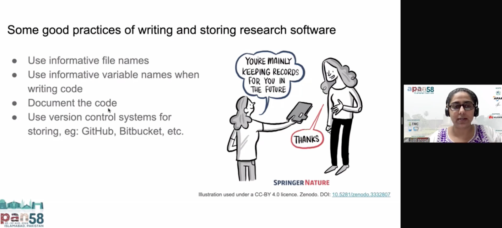

🔑 **Talk Resources:**

1. **Slides:** Jyoti Bhogal. (2024, August 27). What is Research Software and Why Should we Think About its Sustainability?. Zenodo.[https://doi.org/10.5281/zenodo.13377699](https://doi.org/10.5281/zenodo.13377699)

2. **Recording:** APAN58 : Asia Pacific Open and Sharing Data WG, 27th August 2024, Part 1 (Clip from 00:00 to 14:55)
<iframe width="560" height="315" src="https://www.youtube.com/embed/giTd8lN88KQ?si=7P9Tu7Kj90rscXgm&amp;start=1" title="YouTube video player" frameborder="0" allow="accelerometer; autoplay; clipboard-write; encrypted-media; gyroscope; picture-in-picture; web-share" referrerpolicy="strict-origin-when-cross-origin" allowfullscreen></iframe>

------------------------------------------------------------------------

### **Learn More About Us**

For more information and to join upcoming events, visit:

#### RSE Asia

- Website: <https://rse-asia.github.io/RSE_Asia/>
- For the latest news, events, activities, and opportunities, follow us on our [LinkedIn page](https://www.linkedin.com/company/rse-asia-association/)
- To join the RSE Asia community, please fill out our short [Community Membership Form](https://docs.google.com/forms/d/1XSxDaTJzcNyGeDYXyJNVg1TDCo7un18PLFNiK6_jL2g/edit)
