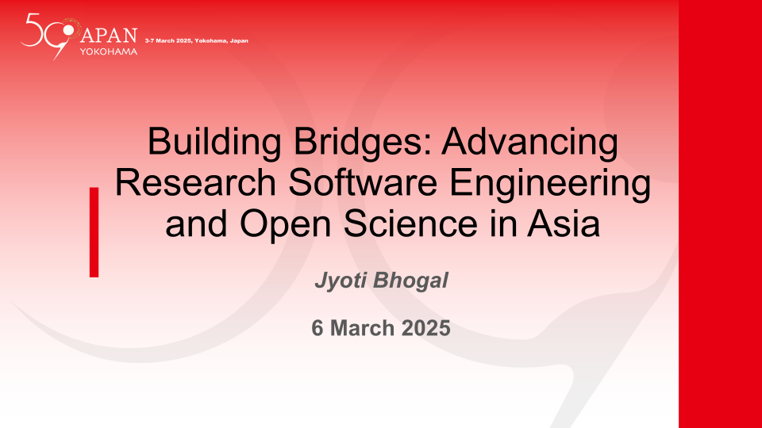

🔑 **Talk Resources:**

1. **Slides:** Bhogal, J. (2025, March 3). Building Bridges: Advancing Research Software Engineering and Open Science in Asia. Zenodo. [https://doi.org/10.5281/zenodo.15180196](https://doi.org/10.5281/zenodo.15180196)

2. **Recording:** Coming soon!

------------------------------------------------------------------------

### **Learn More About Us**

For more information and to join upcoming events, visit:

- Website: <https://rse-asia.github.io/RSE_Asia/>
- For the latest news, events, activities, and opportunities, follow us on our [LinkedIn page](https://www.linkedin.com/company/rse-asia-association/)
- To join the RSE Asia community, please fill out our short [Community Membership Form](https://docs.google.com/forms/d/1XSxDaTJzcNyGeDYXyJNVg1TDCo7un18PLFNiK6_jL2g/edit)