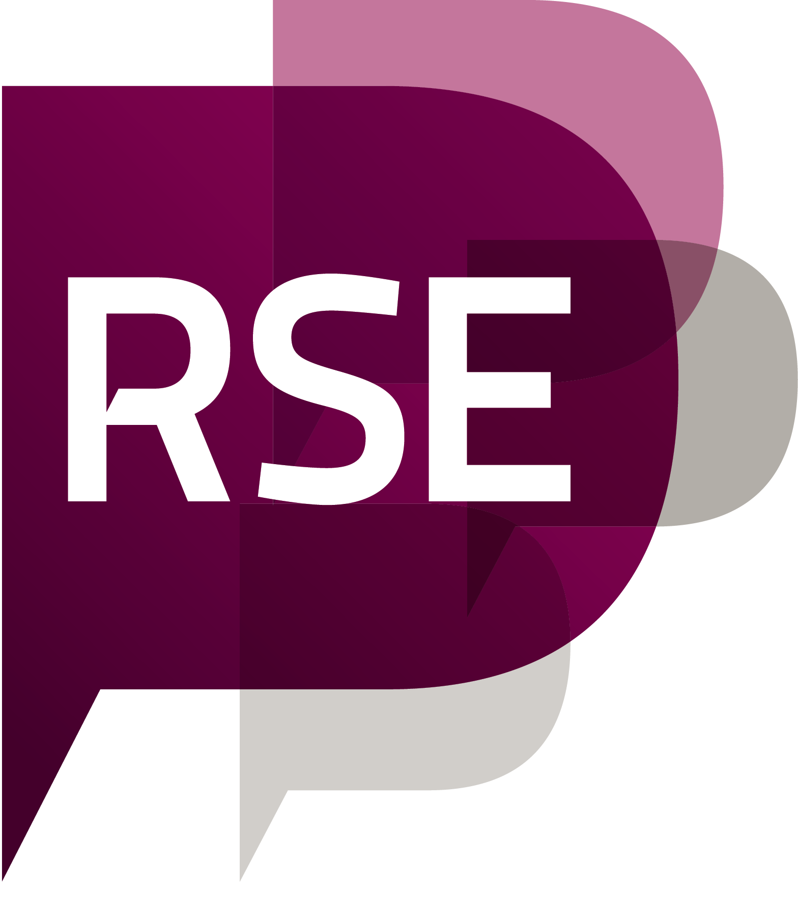

```{r setup, message=FALSE, warning=FALSE, include=FALSE}
library(metathis)
meta() %>%
  meta_description(
    "The website of RSE Asia Association"
  ) %>%
  meta_name("github-repo" = "rse-asia/RSE_Asia") %>%
  meta_viewport() %>%
  meta_social(
    title = "RSE Asia Association",
    url = "https://rse-asia.github.io/RSE_Asia/",
    image = "https://github.com/rse-asia/RSE_Asia/blob/main/images/Updated_RSE_Asia_logo.jpg",
    image_alt = "The RSE Asia Association logo inspired from the logo of the Society of Research Software Engineering - Labelled RSE on top in white capital letters and labelled ASIA below in capital letters.",
    og_type = "website",
    og_author = c("RSE Asia Association"),
    twitter_card_type = "summary",
    twitter_creator = "@RSE_Asia"
  )
```

Welcome to the website of the RSE Asia Association!
 
All spaces of the RSE Asia Association are bound by the [code of conduct](https://society-rse.org/about/code-of-conduct/) of the [Society of Research Software Engineering](https://society-rse.org/). 

$~$

##### Our Mentor Organizations
[{width=10%}](https://openlifesci.org/) $~$     [{width=5%}](https://society-rse.org/events/pilot-mentoring-programme/)
