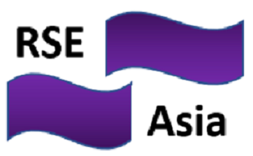

```{r setup, include=FALSE}
knitr::opts_chunk$set(echo = FALSE)
# Learn more about creating websites with Distill at:
# https://rstudio.github.io/distill/website.html
# Learn more about publishing to GitHub Pages at:
# https://rstudio.github.io/distill/publish_website.html#github-pages
```

2021年10月14日木曜日、初めての[国際RSEデー](https://researchsoftware.org/council/intl-rse-day.html)という特別な日に、私たちはRSEアジアアソシエーションを立ち上げます。
この日は初めての[国際RSEデー](https://researchsoftware.org/council/intl-rse-day.html)として祝われているため、特別な意味を持っています!
立ち上げイベントでは、[Hacktoberfest 2021](https://hacktoberfest.digitalocean.com/)に貢献するための活動も行います。
立ち上げイベントにぜひご参加ください。 

:::float-image

```{r out.width='130px', out.extra='style="float:left; padding:10px"', echo=FALSE}

```
これは私たちの公式ロゴです!

:::

このウェブサイトは [distill](https://github.com/rstudio/distill) パッケージを使ってビルドされています。
このウェブサイトのソースコードは [RSE_Asia](https://github.com/rse-asia/RSE_Asia) の GitHub リポジトリにあります。

私たちは、[Society of Research Software Engineering](https://society-rse.org/) の[行動規範](https://society-rse.org/about/code-of-conduct/)を順守します。

Twitter のハンドル [RSE_Asia](https://twitter.com/RSE_Asia/) で最新情報をフォローしてください。
